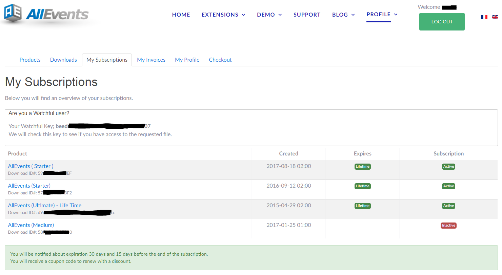
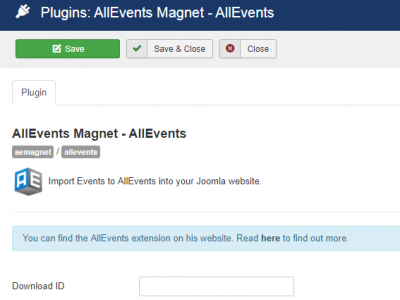

## Where can I find my Download ID ?

You can find your Download ID in your [Subscriptions page](https://www.allevents3.com/en/my-profile/my-subscription).

You have a **Download ID** per each product.

## Where can I set my Download ID ?

Login to the backend and go to Options of yout Component / Module / Plugin

For example for the plugin **AllEvents Magnet – AllEvents**:

!!!! Now you will be notified for the update of our extension through the Joomla Update Manager when a new version is available.

