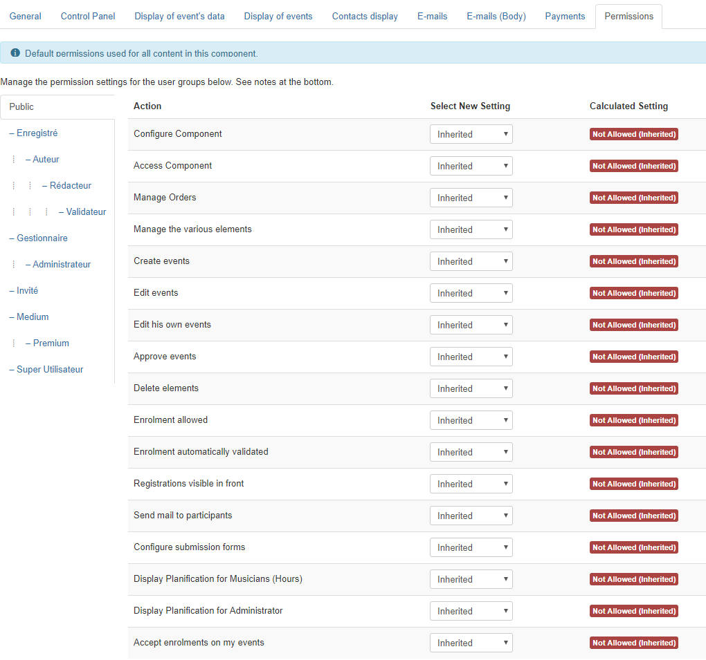

### General [component]
| Option | Description | Type | Value |
| ------ | ----------- | -----|-------|
|  Display Powered By | Display Powered By | radio | `Hide`, `Show` (default: `Show`)|
|  DownloadID | The DownloadID is needed to update AllEvents Premium. You can get your personal DownloadID after subscription at the following link: [https://www.allevents3.com/mes-ids](https://www.allevents3.com/mes-ids) | text |  (default: ``)|
|  Template Form event | Template to be used for creation or modification of an event: standard or wizard | AELayoutEventForm |  (default: `default`)|
|  Template event display | Template to be used to display an event: default or others | AELayoutEvent |  (default: `default`)|
|  Template for main view | Choose your template for the main view : standard ou like a Dashboard | list | `Default`, `Dashboard` (default: `default`)|
|  Template Events in Back | Choose your display for your events management in backend : Joomla native or with new experience | list | `Default`, `Like a Calendar` (default: `default`)|
|  Mode lite | In backend, events are displayed like a calendar. In lite mode, create & update are on the same display. In not lite mode, create & update are on standard Joomla. | radio | `No`, `Yes` (default: `No`)|
|  Button Import Examples | Shows the button Process in events panel in order to import examples | radio | `No`, `Yes` (default: `No`)|
|  Beginner Mode | Show the howto Instructions in the control panel | radio | `No`, `Yes` (default: `No`)|
|  Admin User AllEvents | AllEvents Administrator = must be at least Publisher User Level | user | |
|  Menu by default | Menu Link by default in case of navigation on several ones with loss of Itemid | menuitem | |
|  Force Empty Menu | Force Empty Menu (Empty Itemid). So when you open an event, there is not Itemid propagated | radio | `No`, `Yes` (default: `No`)|

**Enrolments**

| Option | Description | Type | Value |
| ------ | ----------- | -----|-------|
|  Enrolment activated by default | The registrations are opened if 'YES' button is selected | radio | `No`, `Yes` (default: `No`)|
|  Allow Multiple Registrations | Registrations are allowed in backend, there will not be consistency control | radio | `No`, `Yes` (default: `No`)|
|  Max Number of accompanying persons | In case of multiple registrations, defines the Max Number of accompanying persons that can be fulfilled by the user | text | `No`, `Yes` (default: `10`)|
|  Control on event deletion | Controls if there are registrations linked to event.  If NOT: It is possible to unpublish an event, registrations will be automatically cancelled.  If yes: you need to manually delete registrations before unpublish events. | radio | `No`, `Yes` (default: `Yes`)|

**Advanced**

| Option | Description | Type | Value |
| ------ | ----------- | -----|-------|
|  Parent | Target browser window when the item is selected. | radio | `New window with navigation`, `Parent` (default: `_blank`)|
|  Load jQuery | If you are experiencing conflicts with other extensions or the template loading jQuery, set this to 'No'. | list | `Always`, `Never`, `Site Only`, `Administrator Only` (default: `Never`)|
|  Load Bootstrap | If you are experiencing conflicts with other extensions or the template loading Bootstrap, set this to 'No'. | list | `Always`, `Never`, `Site Only`, `Administrator Only` (default: `Never`)|
|  Load Uikit | If you are experiencing conflicts with other extensions or the template loading Uikit (Yoothemes), set this to 'No'. | list | `Always`, `Never`, `Site Only`, `Administrator Only` (default: `Never`)|
|  Google Maps API key | Google no longer provides free API access without an API key. Please visit [https://code.google.com/apis/console/](https://code.google.com/apis/console/) and register for the Google Maps Javascript API v3 service. You will need to create a new Browser Key. Insert your Google Maps API key for use with your installation. Since June 2016, Usage of the Google Maps APIs now requires a key ([http://googlegeodevelopers.blogspot.com.au/2016/06/building-for-scale-updates-to-google.html](http://googlegeodevelopers.blogspot.com.au/2016/06/building-for-scale-updates-to-google.html)). Note that an API key is required as per Google guidelines, although the maps sometimes also work without. | text |  (default: ``)|
|  Custom CSS | You can use custom CSS to add your own styles or overwrite default CSS. | textarea | |
|  Display Import Button | Display a import button on the events views in backend. It's very usefull for have a idea about AllEvents (import events, calendars...). | radio | `Hide`, `Show` (default: `Show`)|
### Control Panel [controlpanel]

Definition of icons in the Control Panel

| Option | Description | Type | Value |
| ------ | ----------- | -----|-------|
|  I use calendars | If you want to use calendars, set this option | radio | `No`, `Yes` (default: `Yes`)|
|  I use activities | If you want to use activities, set this option | radio | `No`, `Yes` (default: `Yes`)|
|  I use categories | If you want to use categories, set this option | radio | `No`, `Yes` (default: `Yes`)|
|  I use venues | If you want to use venues, set this option | radio | `No`, `Yes` (default: `Yes`)|
|  I use publics | If you want to use publics, set this option | radio | `No`, `Yes` (default: `Yes`)|
|  I use resources | If you want to use resources, set this option | radio | `No`, `Yes` (default: `Yes`)|
|  I use sections | If you want to use sections, set this option | radio | `No`, `Yes` (default: `Yes`)|
|  I use external calendars | If you want to use google calendars or ICalendar (ICS) in FullCalendar view, set this option | radio | `No`, `Yes` (default: `No`)|
|  I use custom fields | If you want to use custom fields in your events, set this option | radio | `No`, `Yes` (default: `No`)|
|  I use Payments | If you want to use payments for your bookings, set this option | radio | `No`, `Yes` (default: `No`)|
|  I use planifications | If you want to use custom the specific screen for planification of your events, set this option | radio | `No`, `Yes` (default: `No`)|
|  I use ribbons | If you want to use your personnal ribbons, set this option | radio | `No`, `Yes` (default: `No`)|

Other entities used

| Option | Description | Type | Value |
| ------ | ----------- | -----|-------|
|  I use joomla users | Joomla Users can be used as contacts for events (detailed parameters in Contacts display tab) | AEUseComponent |  (default: `No`)|
|  I use Joomla Contacts | Joomla Contacts can be used as contacts for events (detailed parameters in Contacts display tab) | AEUseComponent |  (default: `No`)|
|  I use CB users | Community Builder Users can be used as contacts for events (detailed parameters in Contacts display tab) | AEUseComponent |  (default: `No`)|

### Display of event's data [display]

Selection of options to be displayed, format display...

**Buttons**

| Option | Description | Type | Value |
| ------ | ----------- | -----|-------|
|  Display the Close button | In frontend, show a close button in the header toolbar of en event | radio | `Hide`, `Show` (default: `Show`)|
|  Display ICS button | In frontend, show a ICS button in the header toolbar of en event for export the event in ICS format | radio | `Hide`, `Show` (default: `Show`)|
|  Display Google Event button | In frontend, show a 'Google' button in the header toolbar of en event for export the event in the google calendar of the user | radio | `Hide`, `Show` (default: `Show`)|
|  Display Print button | In frontend, show a 'print' in the header toolbar of en event | radio | `Hide`, `Show` (default: `Show`)|
|  Display Mail button | In frontend, show a 'mail' button in the header toolbar of en event | radio | `Hide`, `Show` (default: `Show`)|

**Header**

| Option | Description | Type | Value |
| ------ | ----------- | -----|-------|
|  Display avatar of Venue | Selection of  avatar venue display on the Event page | list | `Hide`, `Google Map`, `Picture`, `Street View` (default: `Google Map`)|
|  Display ribbon | Display the ribbon on the right corner of event | radio | `Hide`, `Show` (default: `Show`)|
|  Display admin ribbon | Display the admin ribbons. If Hide, only personnal ribbons will be used | radio | `Hide`, `Show` (default: `Show`)|
|  Display calendar | If you want to show calendar of the event, set this parameter to Yes | radio | `Hide`, `Show` (default: `Show`)|
|  Display activity | If you want to show activity of the event, set this parameter to Yes | radio | `Hide`, `Show` (default: `Show`)|
|  Display public | If you want to show public of the event, set this parameter to Yes | radio | `Hide`, `Show` (default: `Show`)|
|  Display section | If you want to show section of the event, set this parameter to Yes | radio | `Hide`, `Show` (default: `Show`)|
|  Display category | If you want to show category of the event, set this parameter to Yes | radio | `Hide`, `Show` (default: `Show`)|
|  Display resource | If you want to show resource of the event, set this parameter to Yes | radio | `Hide`, `Show` (default: `Show`)|
|  Display author |  | radio | `Hide`, `Show` (default: `Show`)|
|  Display venue | If you want to show venue of the event, set this parameter to Yes | radio | `Hide`, `Show` (default: `Show`)|
|  Display end date |  | radio | `Hide`, `Show` (default: `Show`)|
|  Display avatar |  | radio | `Hide`, `Show` (default: `Show`)|
|  Display image |  | radio | `Hide`, `Show` (default: `Show`)|

**Full Map**

| Option | Description | Type | Value |
| ------ | ----------- | -----|-------|
|  Display venue in full page | Selection of the venue display the venue in full page (in an autonomous section) on the page Event | radio | `Hide`, `Show` (default: `Hide`)|
|  Display adress of venue | Selection of the display of the venue adress | radio | `Hide`, `Show` (default: `Hide`)|
|  GPS display of the venue | Selection of the display of the venue GPS coordinates | radio | `Hide`, `Show` (default: `Hide`)|

**Contacts**

| Option | Description | Type | Value |
| ------ | ----------- | -----|-------|
|  Display Contacts zone |  | radio | `Hide`, `Show` (default: `Show`)|

**Description**

| Option | Description | Type | Value |
| ------ | ----------- | -----|-------|
|  Display description |  | radio | `Hide`, `Show` (default: `Show`)|
|  Display additional information |  | radio | `Hide`, `Show` (default: `Hide`)|

**Comments**

| Option | Description | Type | Value |
| ------ | ----------- | -----|-------|
|  Display comments |  | radio | `Hide`, `Show` (default: `Show`)|

**Enrolments**

| Option | Description | Type | Value |
| ------ | ----------- | -----|-------|
|  Display Registrations zone |  | radio | `Hide`, `Show` (default: `Show`)|
|  Display registrations |  | list | `For nobody`, `For the creator`, `Based on ACL` (default: `Show`)|
|  Enrolments Render |  | list | `as a number`, `as a sentence` (default: `as a number`)|
|  Display Perhaps button | Display the Perhaps button in the Registration banner | radio | `Hide`, `Show`, `Always` (default: `Hide`)|
|  Display No button | Display the button No in the Registration banner. Very useful for definitive registrations | radio | `Hide`, `Show` (default: `Show`)|
|  Companion as participant | A companion are considered as a participant in the event. If no, only the participant is checked | radio | `No`, `Yes` (default: `No`)|

**Advanced**

| Option | Description | Type | Value |
| ------ | ----------- | -----|-------|
|  Expanded zones | Informations linked to event are by default in full page (displayed) | radio | `No`, `Yes` (default: `No`)|

### Display of events [param_display]

**General events parameters**

| Option | Description | Type | Value |
| ------ | ----------- | -----|-------|
|  Bullet calendar full page | The Bullet is a circle which takes back Color or Bullet of the Calendar | list | `Bullet`, `Color` (default: `bullet`)|
|  Entity anchor | Selection of entity Calendar, Activity, Category to be used for the display of events (Color, avatar) | list | `Calendar`, `Activity`, `Category` (default: `Calendar`)|
|  Backcolor | Color to be used for the bottom (text or bottom of entity anchor) | list | `Backcolor`, `Color of text` (default: `Color of text`)|
|  Forecolor | Color to be used for the text (text or bottom of entity anchor) | list | `Backcolor`, `Color of text` (default: `Color of text`)|
|  Display an event on all days | In a view calendar, allows to show only the first day of event (NO)  ** OR **   to show all days of the event | radio | `No`, `Yes` (default: `Yes`)|

**Dates and hours parameters definition**

| Option | Description | Type | Value |
| ------ | ----------- | -----|-------|
|  Format of Date | Choose the format of display of date. If using dates from language file you can override these formats by changing the translation. Specific format must contain only Y, m, d, H, i, a, g. | list | `French, English`, `Germany, Switzerland`, `US`, `ISO Format`, `From the file language` (default: `Y-m-d`)|
|  Format | Display an hour in format 24h or 12h AM/PM | list | `24 h (military)`, `12 h am/pm` (default: `H:i`)|
|  Step | Choose your personnel step to choose a time | text |  (default: `30`)|
|  Week starts on | The starting day of the week (used when the list of the days of the week is displayed). | list | `Lundi`, `Dimanche` (default: `Lundi`)|

### Contacts display [contacts]

Choice of datas and display formats for each Contacts types used

**Joomla Users**

| Option | Description | Type | Value |
| ------ | ----------- | -----|-------|
|  Show Joomla account |  | radio | `Hide`, `Show` (default: `Hide`)|
|  Show name |  | radio | `Hide`, `Show` (default: `Show`)|
|  Show email address |  | list | `Hidden`, `Not clickable`, `Clickable` (default: `Clickable`)|
**Joomla Contacts**

| Option | Description | Type | Value |
| ------ | ----------- | -----|-------|
|  Show name |  | radio | `Hide`, `Show` (default: `Show`)|
|  Link to Contact | Link to Joomla Contact information | radio | `Hide`, `Show` (default: `Show`)|
|  Show Joomla account | Only available for Contacts associated to an User | radio | `Hide`, `Show` (default: `Hide`)|
|  Show email |  | list | `Hidden`, `Not clickable`, `Clickable` (default: `Clickable`)|
|  Show position |  | radio | `Hide`, `Show` (default: `Hide`)|
|  Address format |  | AEJContactAddressFormat | |
|  Show telephone |  | radio | `Hide`, `Show` (default: `Hide`)|
|  Show mobile |  | radio | `Hide`, `Show` (default: `Hide`)|
|  Show fax |  | radio | `Hide`, `Show` (default: `Hide`)|
|  Show web site |  | radio | `Hide`, `Show` (default: `Hide`)|
|  Show misc infos |  | radio | `Hide`, `Show` (default: `Hide`)|

**Community Builder User**

| Option | Description | Type | Value |
| ------ | ----------- | -----|-------|
|  Display name |  | radio | `Hide`, `Show` (default: `Show`)|
|  CB User link | Link to Community Builder User profile | radio | `Hide`, `Show` (default: `Show`)|
|  Display CB account |  | radio | `Hide`, `Show` (default: `Hide`)|
|  E-mail field |  | AECBField | `-- Not shown --` (default: `-- Not shown --`)|
|  Display e-mail |  | list | `Hidden`, `Not clickable`, `Clickable` (default: `Clickable`)|
|  Organization field |  | AECBField | `-- Not shown --` (default: `-- Not shown --`)|
|  Position field |  | AECBField | `-- Not shown --` (default: `-- Not shown --`)|
|  Adresse format |  | AECBUserAddressFormat | |
|  Telephone field |  | AECBField | `-- Not shown --` (default: `-- Not shown --`)|
|  Mobile field |  | AECBField | `-- Not shown --` (default: `-- Not shown --`)|
|  Fax field |  | AECBField | `-- Not shown --` (default: `-- Not shown --`)|
|  Web site field |  | AECBField | `-- Not shown --` (default: `-- Not shown --`)|
|  Misc infos field |  | AECBField | `-- Not shown --` (default: `-- Not shown --`)|

### E-mails [mails]

see [Customizing e-mail](https://documentation.allevents3.com/allevents-advanced/customizing-e-mail)

### E-mails (Body) [editmails]

see [Customizing e-mail templates](https://documentation.allevents3.com/allevents-advanced/customizing-e-mail-templates)

### Payments [payment]

**Payment orders**

| Option | Description | Type | Value |
| ------ | ----------- | -----|-------|
|  Base Currency | Enter a 3-character currency code, for example EUR - Euro. Please consult [this list](http://www.xe.com/iso4217.php) when setting up your preferred currency.| text |  (default: `EUR`)|
|  Select Payment Gateway | Select which one of the available payment gateways that will be used with for transactions. You will need to configure and enable the payment plugins for selected gateways as required in the Plugin configuration. | gatewayplg | |

### Permissions Settings [Setting Access Levels]

Default permissions used for all content in this component.

| Action | Description |
| ------ | ----------- |
| Configure ACL & Options | Allows users in the group to edit the options and permissions of this extension. | 
| Access Administration Interface | Allows users in the group to access the administration interface for this extension. | 
| Manage Orders | Allows to manage orders, payments,... | 
| Manage the various elements | Allows to manage (creation, update, delete) of calendars, activities, places... | 
| Create events | Allows to create events | 
| Edit events | Allows to edit all events | 
| Edit his own events | Allows to only edit own events | 
| Approve events | Allows to approve any proposals of event (Automatically approved or Requires approval) | 
| Delete elements | Allow to delete elements like events, calendars,... | 
| Enrolment allowed | The user can register for an event | 
| Enrolment automatically validated | Enrolment validated without a moderator approval | 
| Registrations visible in front | The user can see all registrations in front | 
| Send mail to participants | The user can send a mail to event's participants | 
| Configure submission forms | The user can configure the forms used to be for submit a event throught the web site | 
| Display Planification for Musicians (Hours) | Display Planification for Musicians (Hours) | 
| Display Planification for Administrator | Display Planification for Administrator | 
| Accept enrolments on my events | Accept enrolments on my events | 
