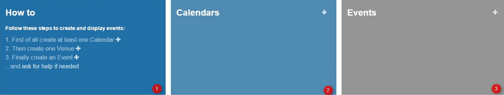
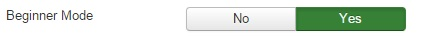
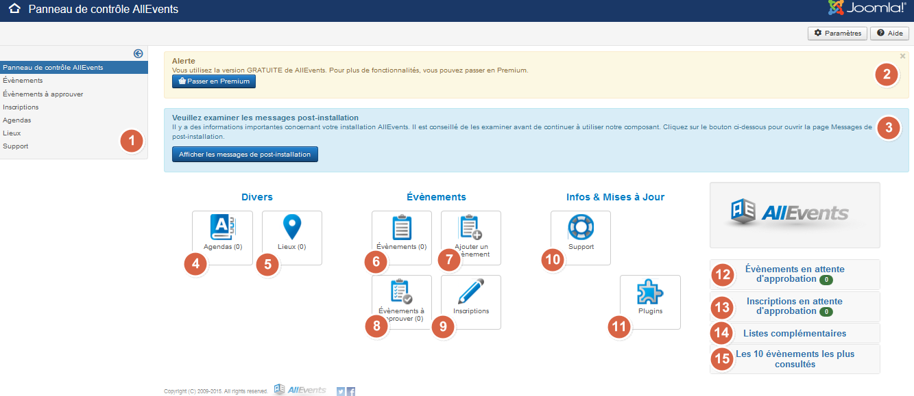

Log into admin panel of your website to access to the AllEvents panel control, Then goto Components => AllEvents.

Since 3.3.1 version, a new banner has been added under the alert message and the post-installation message. This banner intends to help you in creating your first events. 

1 – **How to**: This frame explains how to get started with Allevents.  + Buttons on the right of every line provides direct access to agenda, venue and event creation screens.
2 – **Calendars**: This frame gets back the created calendars. + Button on the top right provides direct access to the agenda creation screen.
3 – **Events**: This frame gets back the created events. + Button on the top right provides direct access to the events creation screen.

! You can deactivate this banner display by switching the general parameter to **No**  

Here is how looks like the panel control without beginner banne : 

Detailed view about all functions:

1. This sidebar shows all links as a menu.
2. This banner reminds you are using the free version.
3. This banner informs you that Allevents post-installation messages are available. Once you will have read these messages, they will no longer appear.
4. **Agendas**: By clicking this button, you can browse, edit, cancel, create … your agendas.
5. **Venues**: By clicking this button, you can browse, edit, cancel, create … your venues.
6. **Events list**: Shortcut to edit your events list.
7. **Add an event**: Shortcut to directly create an event without going to event creation page.
8. **Event to approve**: Shortcut icon to edit your events approval list.
9. **Registrations**: Shortcut to edit your registration list.
10. **Support** : Shortcut to miscellaneous information about AllEvents
11. **Plugins**: Shortcut to Joomla plugins page filtered on AllEvents component .
12. **Events awaiting for approval**: Events list that are waiting for approval by an administrator.
13. Registrations awaiting for approval by an administrator.
14. Overbooked registrations awaiting for approval by an administrator
15. **Top ten events**: Top ten of events that are  the most read. 