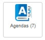
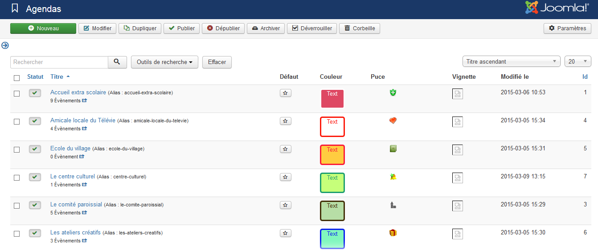
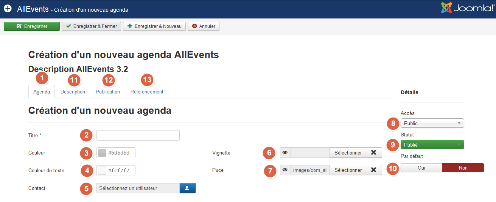

All Allevents features have a common basis: the calendar concept. An event is linked to a calendar. The "Museum visit" will be part of the "Visit" calendar while the "Meeting" event could be part of the "club life" calendar, the "Summer internship" part of a "Our children" calendar.  
You could decide that you should need only one calendar on your website and that this “calendar concept” is not mandatory. No problem! An event is not linked in a mandatory way to a calendar and you couldn’t care.
However, as nobody knows how your website can envolve, I advise you to create a calendar in order to be ready the day you would need. By creating a calendar since the beginning, your events and other AllEvents data will already be on the right way and it will simplify the multi-calendar enhancement.

Log into administration website in order to create a calendar. Then go to AllEvents menu. Click on 

## List of existing calendars is displayed

Click on Add button, it opens the next form.

! Only the calendar title is mandatory (1), However, we advise you to fulfill the next parameters in order to to make nice your calendar and website.

1. **Calendar Tag**: Gets back main data form the calendar

2. **Title**: It’s the calendar title. Select something quite generic that makes efficient your events classification.

3. **Color**: You can define a background color

4. **Text Color**: You can define a text color. 

!!!! You can choose a custom color for the calendar by using the color picker. If you select a dark color for your category color then we have another color selector that you can use to select the color of the text that is displayed over the background color.

5. **Contact link**: You can select a user  who will informed by e-mail during a registration to an event and an event proposal.

6. **Thumbnail**: You can assign a thumbnail to your calendar. This thumb will be used in the event description page, the calendar description page or the frontend. The calendar thumb will be used to represent the event if you don’t select another thumb in the event edit panel.

7. **Bullet**: You can define a bullet for your calendar. This bullet will be used everywhere in your website frontend in order to symbolize the calendar. Allevents already includes some bullets, but you can also upload your ones from tour computer.

8. **Acces**: You can define an access level (the access level that is required to see the calendar) for your calendar. By default this parameter is set to « public ».

9. **Status**: You can define the calendar status. If you don’t publish the calendar, the events related to the calendar will not be published too

10. **By default**: You can define if the calendar is the one that will automatically be assigned at an event creation.

11. **Description**: You can write a description of your calendar. This description is as all joomla articles a HTML code. It means that you can write as you will do an article by adding links, images… This description id displayed in the website frontend in the calendar pages.
To go further, you can also fulfill next parameters:

12. **Publishung options**

13. **Referencing Optimization**: In order to optimize your website referencing, you can fulfill the meta-data: description, keywords and robots.

!!!! The colors will be used in the frontend pages in order to differentiate events by calendar either in the events lists, in the calendar or in the description event page.
