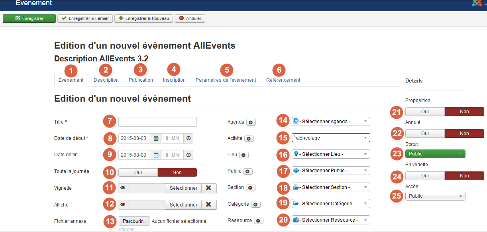
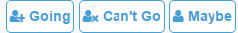

Log into administration website in order to create an event. Then go to Allevents menu. Click on 

Next panel is displayed:

1 – **Event tag**: main data of the event.

2 –  **Description tag**: You can write a description of your event. This description is as all joomla articles a HTML code. It means that you can write as you will do an article by adding links, images… This description id displayed in the website frontend in the event pages. 

3 – **Publishing tag**: This tag contains various data as its identifier, Clicks number, creation and modification date,... The publishing date and hour is the date when the event will be available on the site. 

4 – **Registration tag**: If you want open the user registration, switch the Allow registrations button to Yes. Registration Form displays three buttons: Going, can't Go, Maybe 

Registration start date: The users will be able to register to the event starting with this date and hour. 
Registration end date: From this moment, the registration ends for this event. 

5 – **Parameter tag**: as for publishing tag, parametr tag contains annex data related to the event, ex: contact person.

6 – **Metadata tag**: You can fulfill meta description, keywords, robots in order to optimize referencing. 

7 – **Title**: Event title.

8&9 – **Date**: You must assign at least a beginning date to your event. You can also assign a end date You can assign a time by end or with the scroll list. (ex. “15/04/2012 18h30”). The enddate must be higher then the starting date.

! After the date, users will no longer be able to register for this event.

10 – If the event lasts the whole day, stick this check box instead of fulfilling the time. It means your event start at 0:00 AM and ending in 11:59 PM. If the event is an “All-day” event, no time will be needed in this case.

11&12 – **Thumbnail and poster**: You can assign a thumbnail and a poster to the event. 

13 – **Attached file**: You can complete your event with a file containing your poster, flyer...

14-20 – **Calendar / Activity / Venue / Public / Section / Category / Resource**: If you have previously created these items, you can assign one of them to your event. If a value doesn't exist, you can click on the button and fulfill the title and color data. Afterwards, you can complete the other data in the AllEvents panel control.

!! According to your plan, your event may have some or all of the following filter groups available: Event / Calendar / Activity / Venue / Public / Section / Category / Resource. In frontend, if only one of these haven't a public profil, the event will not be displayed.