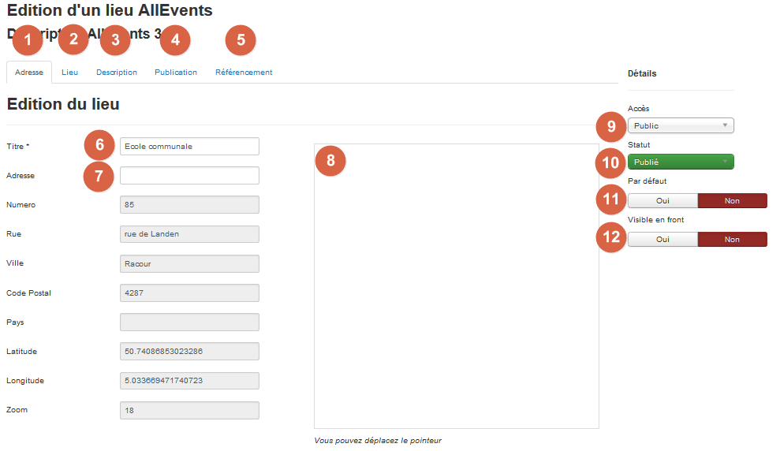

! Before Adding a Venue : Enable Google Maps JavaScript API for your site (on google website) and set the Google Maps JavaScript API key in the parameters.

In AllEvents you can easily locate your events and/or calendars.

You can define these parameters in your venue:

1 – **Address tag**: venue address.

2 – **Venue tag**: additional data: email, phoe, bullet and thumbnail

3 – **Description tag**: You can write a description of your event. This description is as all joomla articles a HTML code. It means that you can write as you will do an article by adding links, images… This description id displayed in the website frontend in the event pages.

4 – **Publishing**: General data of the venue as clicks number, creation and modification date,...

5 – **Metadata tag**: You can fulfill meta description, keywords, robots in order to optimize referencing.

6 – **Title**: Venue title.

7 – **Adress**: Venue adress. This adress will be converted in exact data (Number, street, City, zipcode, Country, Latitude, Longitude) thanks to Google map.

8 – **Google map**: You can fulfill here information related to Gogle map. It's possible to move the cursor to fine tune the exact location.

9 – **Access**: You can define an access level for your venue. By default, it's set to "Puclic access"

10 – **Status**: You can define the venue status. Take care, if you don't publish the venue, the related events will not published too.

11 – **By default**: You can define if this venue will be assigne by default at the event creation.

12 – **Visible in frontend**: You can define if the venue is visible in the frontdend. In main cases, its' useful to do it. -- deprecated --

Once you have fulfilled all informtion you need, just save it.

If you want assign this map to a specific event, edit it and select this map in the venue topic.