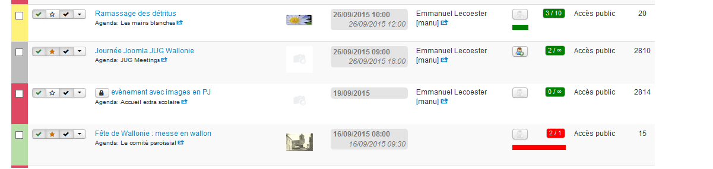

Did you have already remarked the number of information available in this webpage getting back the list of events in backend?

The color of the first column of one several events is the color of the calendar of your event. The background color of the calendar "Les mains blanches" is yellow.

The panel displays 4 buttons to publish an event, highlight an event, accept the proposal of an event and a button that displays the list of additional fonctionalities (Modify, Duplicate,...)

At the column the title of the event is displayed as a clickable link and just below the calendar of your event. Vous can see a small icon on the the right of the title of the calandar. This icon is used to filter the events based on the calendar  of the events of its calendar.

Next information are the thumbnail of the event, dates of beginning and end of the event. The display is optimized based on the elements of your event (same beginning and end date, full day event).

Next column is the author name with his nickname followed by the filter icon used to retrieve all the events of an author.

Next column is the main information about registration... There is first a button to inform if registrations are open followed by an insert about the number of registered people and the maximum number autorized. There is just below a progress bar to inform about the percentage completion. The overall is green if all is OK, or red if the maximum number of registered people is exceeded.

Last information is the access level of the event followed by its ID.

You know now all about this panel that includes too available filters on the top of the webpage.