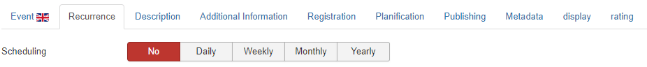
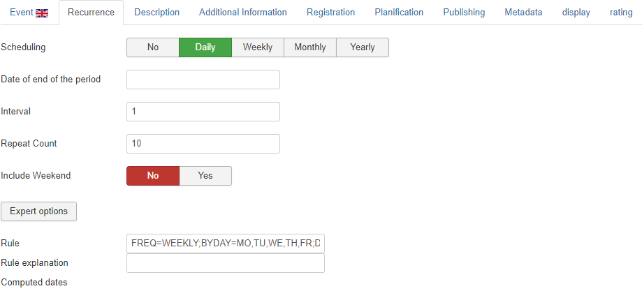
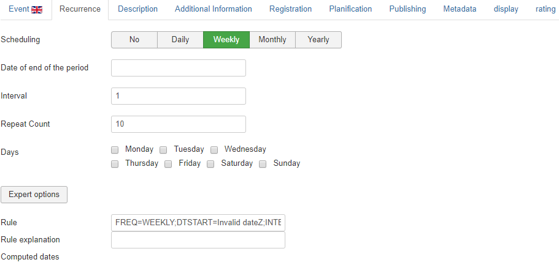
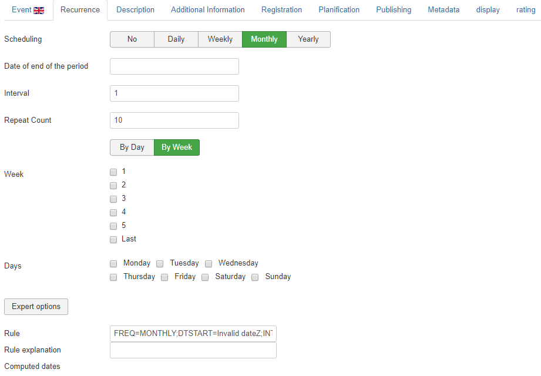
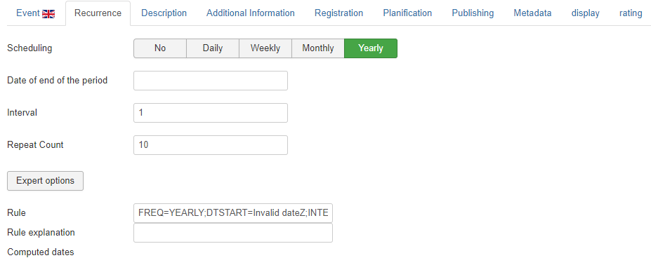

## Recurrence
If the Recurring option has been checked within the specific Event tab, this screen will become available. AllEvents offers the necessary tools to cover all aspects regarding recurring events.

**Repeat** : daily / weekly / monthly / yearly - allows you to specify an interval and time frame. 

**Date of end of the period**: allows you to set on which date the repeat process will end.

**Interval**: Interval between each event to create. If the value is higher than 1 it means the event is created every nth day/week/month depending on the scheduling type.

**Repeat Count**:How many times the event is repeated until the scheduling end date. If the value is -1 it means it will be repeated until the scheduling end date.

**Include Weekend**: Have the events to be created in the weekend days too (including Saturday and Sunday)?

**Days**: The week days when the events have to be created.

**Week**: Which week of the month.

## 4 recurring types: 
* **Daily events**: this option allows to create repeated events on a daily basis. Enter the number of days you wish to repeat the event, the time of day and click Update Events! to create the recurring events. 
* **Weekly events**: this option allows to create repeated events at weekly intervals. Select this option if you want to repeat your event on a certain weekday, then enter the number of weeks, the day and hour to multiply the event. 
* **Monthly events**: this option allows to create repeated events at monthly intervals. Set the number of months you want to repeat the event, then pick a day of the month and the hour. 
* **Yearly events**: this option allows to create repeated events on a yearly basis. Set the number of years and the full date and hour (Month, Day, Time) and the event will be multiplied for the next years using these details.