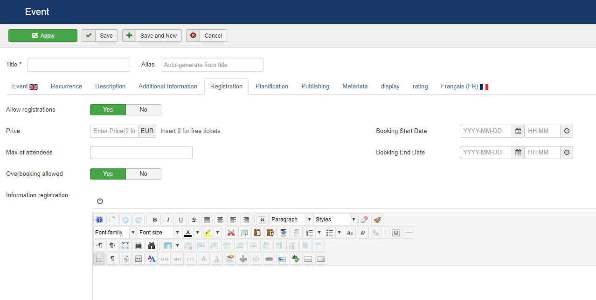

AllEvents allows to register event participants in two ways:

* **Via the back end**. Site administrators create the registrations via the AllEvents Registrations menu
* **Via the front end**. Users can register themselves from the event's page.

## Enable registrations in the specific events.

In backend : 
1. Open your Event
2. Open the Registratiosn tab and set **Allow registrations** on Yes

3. Click Save & Close

## Tweak the component's Access Control List

1. Open the Configuration view for AllEvents
2. Click on the Permissions tab

3. Click the Guest tab
4. Select Allowed setting for the **Enrolment allowed** action

5. Click Save

Permissions allowed are : 
* **Enrolment allowed**: The user can register for an event in front

* **Enrolment automatically validated**: Enrolment (Registration) validated without a moderator approval

* **Registrations visible in front**: The user can see all registrations in front

Now visit the event's page. You should see the Register blue button displayed underneath the event details.
