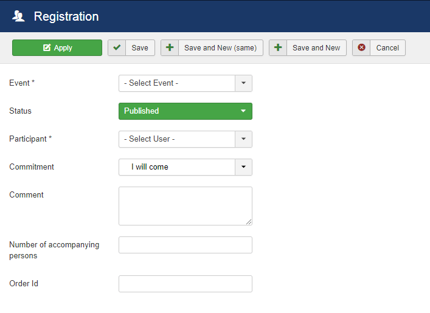

## Set registration back end

1. Open List of registrations view
2. Click on Create Button
3. You have a view for a registration

Set the values : 
* Event : Event (mandatory)
* Status : Technical status of registration. `Published` by default.
* Participant : User (mandatory)
* Commitment : Status of registration : `I will come`, `Sorry, I will not be able to come`, `I don't know yet`, `Not yet validated`
* Comment : A comment for the enrolment
* Number of accompanying persons  

4. Click on Save
