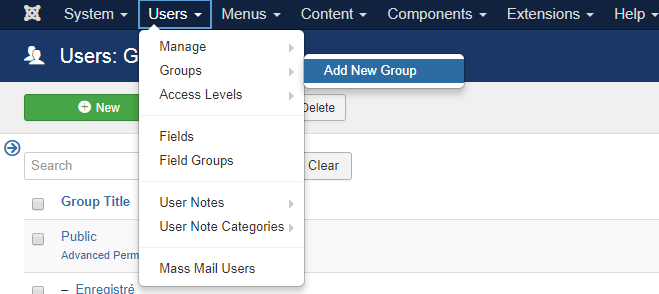
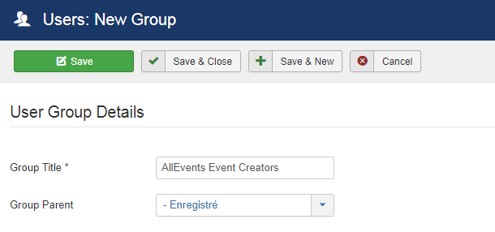
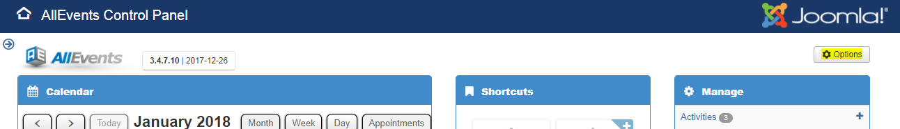
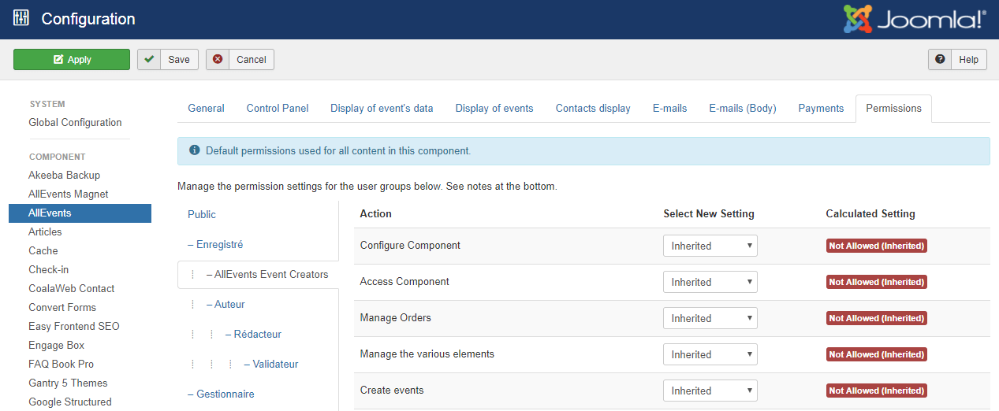
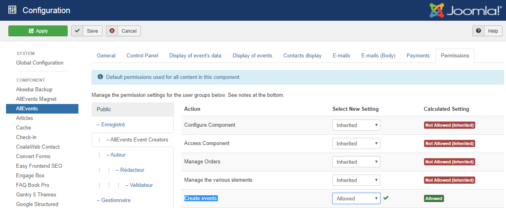
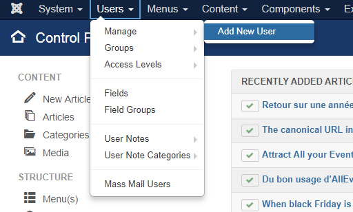
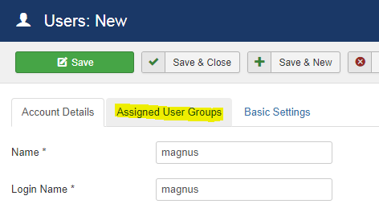
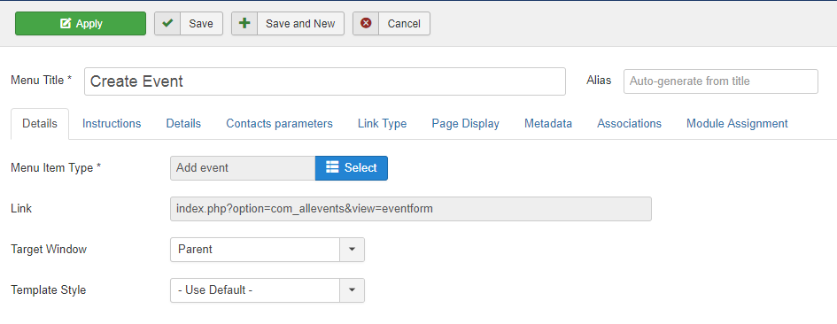

AllEvents allows you to delegate event creation to a designated user from your website's frontend.

For the purpose of this tutorial, we will assign this task to a fictitious user Magnus.

## Group Management

* In your Joomla control panel, click **Users > Groups > Add New Group**:

You will see Users: New Group page.

1. Enter _AllEvents Event Creators_ into the Group Title field.
2. Select the _Registered_ user group from the Group Parent field.
3. Click _Save & Close_.

* Go to Components > AllEvents to open AllEvents control panel.
* You will see the AllEvents: main default page. In the top-right corner, click the Options button:

You will see the AllEvents Configuration page. Click the Permissions tab
Click the AllEvents Event Creators link:

Locate the **Create events** in the Action column. Select **Allowed** and click Save & Close.

You are now ready to delegate front end AllEvents event creation to your Joomla user Magnus.

## User Management

* Go to Users > Manage:

* You will see Users: Edit page with Magnus's account details. Click the Assigned User Groups tab.

* Click the AllEvents Event Creators checkbox:

* Click Save & Close.

Good job! You can now test how Magnus will create AllEvents events from your site frontend.

## Menu Management

* Create a menu item by the AllEvents > Add Event type with the title Create Event:

You will now see it at your site front end. 

Login as your Magnus user to your site front end. 

Click the Create Event menu.

You will see the Add Event front end page.

