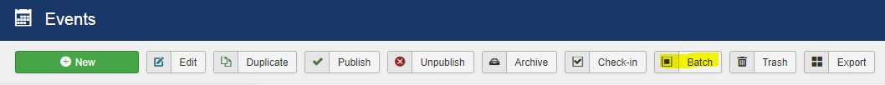
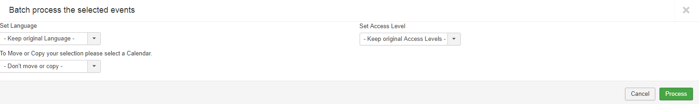

## Sometimes you may want to make changes to multiple events at one time, here is how to do so. 

1. Click on the check-boxes of the events you wish to bulk edit. You can filter the list by event title, categories, tags, venues, organizers and feeds if you have a lot of events!

2. Using “Batch” you can Set the language, Move or Copy to a selected Calendar, Set Access Level.

3. Click Process
