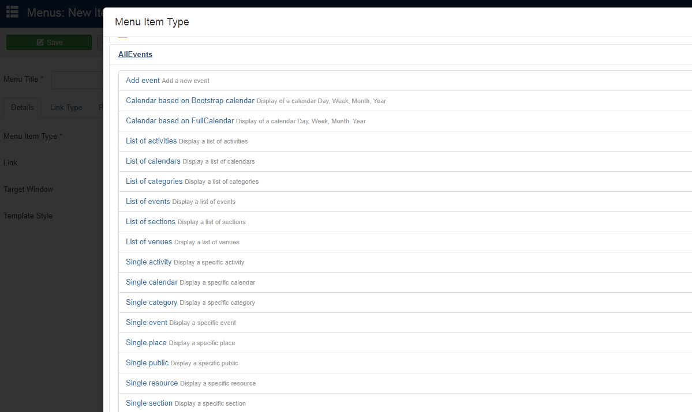

In many cases, it's practical to create more than one AllEvents menu item, each with different sets of events being displayed.

Some examples include:

* Different menu items linking directly to different AllEvents views (Monthly View, Map View, etc...)
* Different menu items displaying events from different calendars
* Different menu items displaying events from different venues
* Seperate menu item to display a users personal calendar (i.e. with only their private events)
* Seperate menu item for creating new events

To create a menu item for your main menu:
1. In the Joomla administrative back end, go to **Menus >> Main Menu >> Add New Menu Item** 
2. You will see "Menus: New Item" administrative page. Click Select and Click on your desired menu type:

* [Add event](https://documentation.allevents3.com/allevents-component/submit-event): Display a form to submit an event in the frontend
* [Calendar based on Bootstrap calendar](https://documentation.allevents3.com/allevents-component/calendar-based-on-bootstrap-calendar): Display of a calendar Day, Week, Month, Year
* [Calendar based on FullCalendar](https://documentation.allevents3.com/allevents-component/calendar-based-on-fullcalendar): Display of a calendar Day, Week, Month, Year
* [List of activities](https://documentation.allevents3.com/allevents-component/list-of-activities): Show the list of Activities
* [List of calendars](https://documentation.allevents3.com/allevents-component/list-of-calendars): Show the list of Calendars
* [List of categories](https://documentation.allevents3.com/allevents-component/list-of-categories): Show the list of Categories
* [List of events](https://documentation.allevents3.com/allevents-component/list-of-events): Show the list of Events
* [List of sections](https://documentation.allevents3.com/allevents-component/list-of-sections): Show the list of Sections
* [List of venues](https://documentation.allevents3.com/allevents-component/list-of-venues): Show the list of venues
* [Single activity](https://documentation.allevents3.com/allevents-component/a-unique-activity): Shows a specific Activity
* [Single calendar](https://documentation.allevents3.com/allevents-component/a-unique-calendar): Shows a specific Calendar
* [Single category](https://documentation.allevents3.com/allevents-component/a-unique-category): Shows a specific Category
* [Single event](https://documentation.allevents3.com/allevents-component/a-unique-event): Shows a specific Event
* [Single public](https://documentation.allevents3.com/allevents-component/a-unique-public): Shows a specific Public
* [Single resource](https://documentation.allevents3.com/allevents-component/a-unique-resource): Shows a specific Resource
* [Single section](https://documentation.allevents3.com/allevents-component/a-unique-section): Shows a specific Section
* [Single venue](https://documentation.allevents3.com/allevents-component/a-unique-venue): Shows a specific Venue

3. Set your AllEvents parameters
4. Give your menu item an appropriate title. Specify any appropriate options (Parent Item, Ordering, Status, etc) in the parameters column to the right 
5. Click Save or Save & Close.

