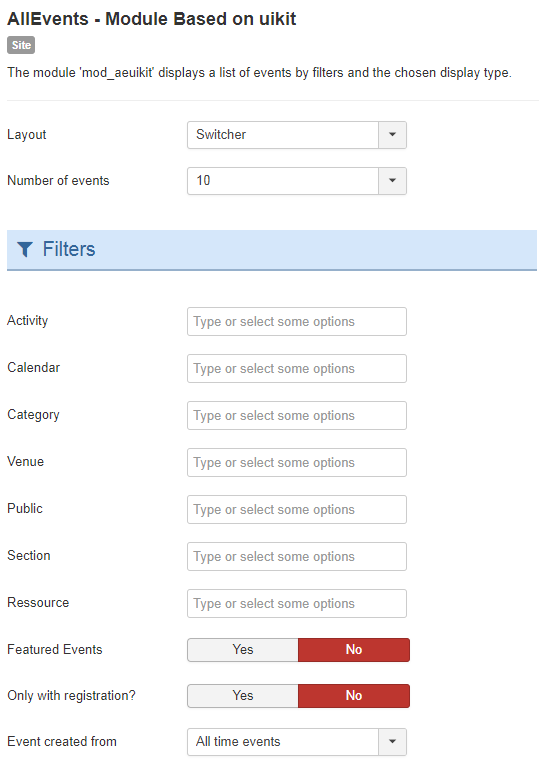
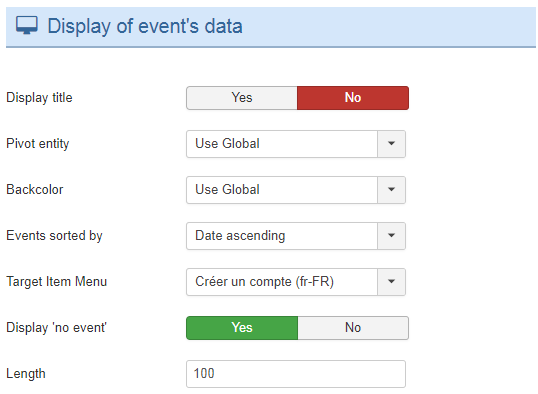

The module 'mod_aeuikit' displays a list of events by filters and the chosen display type.

## Table of Contents
1. [Install the module](#install-the-module)
2. [Configure the module](#configure-the-module)
3. [My events are not displayed](#my-events-are-not-displayed)
4. [Frequently Asked Questions](#frequently-asked-questions)

**Why choose AllEvents Premium ?**

* Display your events friendly.
* View events via  multiple layout.
* User friendly interface.
* Full layout or Compact layout.
* ...

<a href="https://www.allevents3.com/en/our-products/product/mod_aeuikit" role="button" class="btn btn-blue btn-lg" style="background:#46b8da;color:white">Download</a> or [Live Demo](https://www.allevents3.com/en/demo/mod_aeuikit)

## Install the module
1. Download the extension to your local machine as a zip file package.
2. From the backend of your Joomla site (administration) select **Extensions >> Manager**, then Click the <b>Browse</b> button and select the extension package on your local machine. Then click the **Upload & Install** button to install module.
3. Go to **Extensions >> Module**, find and click on **AllEvents - Module Based on uikit**. Then enable it.

! If you have problems installing or updating the extension, please try the manual installation process as described here: docs.joomla.org/Installing_an_extension

## Configure the module
Once you have created a new AllEvents module, you can quickly gain access to its customization options by visiting `Administrator -> Extensions -> Module Manager` and selecting your AllEvents module.

Creating a new module is a simple process, as well. You just navigate to the **Module Manager** and select **New** on the toolbar in the upper-left area of the page.

Below, we have outlined the options available to you as you configure your AllEvents module : 

### basic
| Option | Description | Value |
| ------ | ----------- | ----- |
|  Layout | Use a layout from the supplied module or overrides in the templates. | `Switcher`, `Slider`, `Grid 2 evts`, `Grid 3 evts`, `Grid 4 evts`(default:`switcher`)|
|  Number of events | Enter number of events you want to display in the module, default value is 5 and 5 events will be displayed. | `1`, `2`, `3`, `4`, `5`, `6`, `7`, `8`, `9`, `10`, `11`, `12`, `13`, `14`, `15`, `16`, `17`, `18`, `19`, `20`(default:`5`)|

**Filters**

| Option | Description | Value |
| ------ | ----------- | ----- |
|  Activity | Choose an Activity. Without selection, `all` will be used. | |
|  Agenda | Choose an Agenda. Without selection, `all` will be used. | |
|  Category | Choose a Category. Without selection, `all` will be used. | |
|  Place | Choose a Place. Without selection, `all` will be used. | |
|  Public | Choose a Public. Without selection, `all` will be used. | |
|  Section | Choose a Section. Without selection, `all` will be used. | |
|  Resource | Choose a Resource. Without selection, `all` will be used. | |
|  Featured Events | Show only events designated as featured or `All`. | `Yes`, `No`|
|  Only with registration? | Show only events with at least one entry or `All` | `Yes`, `No`|
|  Event created from |  | `All time events`, `One Month`, `One Week`, `... days`, `... date`|
|  Events to display | Upcoming events, past events, todays events,... | `All time events`, `Next and current`, `passed and current`, `Today`(default:`1`)|
|  ... date |  | |
|  ... days |  | `1`, `2`, `3`, `4`, `5`, `6`, `7`, `8`, `9`, `10`, `11`, `12`, `13`, `14`, `15`, `16`, `17`, `18`, `19`, `20`, `21`, `22`, `23`, `24`, `25`, `26`, `27`, `28`, `29`, `30`|

**Display of event's data**

| Option | Description | Value |
| ------ | ----------- | ----- |
|  Display title | Display or hide the event title | `Yes`, `No`(default:`1`)|
|  Pivot entity | Entity Agenda, Activity, Category to use for events display | `Use Global`, `Agenda`, `Activity`, `Category`|
|  Backcolor | Color defined for Backcolor (Backcolor / Forecolor of pivot entity) | `Use Global`, `Backcolor`, `Forecolor`|
|  Events sort by | Events sort by | `Date ascending`, `Date descending`, `Enddate ascending`, `Enddate descending`, `Most viewed descending`|
|  Target Item Menu | Assign an ItemID by selecting a menu item in the list for the display of the event if there is no com_allevents menu item and a specific display is desired. If you do not know what this means, you may not need it. | |
|  Display 'no event' | Show no event if there no event to display | `Yes`, `No`(default:`1`)|
|  Length | Length of the text | (default:`100`)|
### advanced
| Option | Description | Value |
| ------ | ----------- | ----- |
|  Module Class Suffix | A suffix to be applied to the CSS class of the module. This allows for individual module styling. | |
|  Caching | Use the global cache setting to cache the content of this module or disable caching for this module. | `Use Global`, `No caching`(default:`1`)|
|  Cache Time | The time in seconds before the module is recached. | (default:`900`)|
|  cachemode |  | (default:`static`)|

## My events are not displayed

If you want to display the events on the AllEvents - Module Based on uikit, you should make sure that:
 
1. The module or plugin is published (obviously)
2. The module assigned to a visible module position. There can be many module positions listed for you to select, but make sure that the module position you select is visible in front-page.
3. The module is assigned to a menu. When you want to display a module on specific menus, you need to assign it to the menus.
4. the filters selected have events (obviously).
5. your entities filtred are published.

## Frequently Asked Questions
No questions for the moment