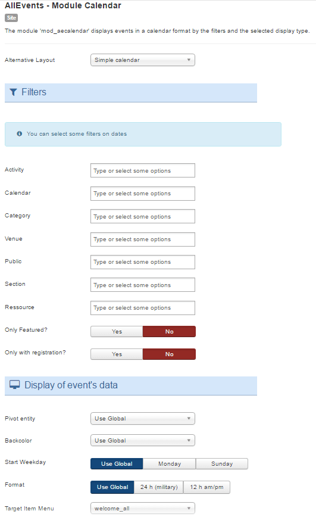

The module 'mod_aecalendar' will display all events from your component AllEvents on a calendar. It can also display events via list view and detail of each event.

## Table of Contents
1. [Install the module](#install-the-module)
2. [Configure the module](#configure-the-module)
3. [My events are not displayed](#my-events-are-not-displayed)
4. [Frequently Asked Questions](#frequently-asked-questions)

**Why choose AllEvents Premium ?**

* Display your events friendly.
* View events via  multiple layout.
* User friendly interface.
* Full layout or Compact layout.
* ...

<a href="https://www.allevents3.com/en/our-products/product/mod_aecalendar" role="button" class="btn btn-blue btn-lg" style="background:#46b8da;color:white">Download</a> or [Live Demo](https://www.allevents3.com/en/demo/mod_aecalendar)

## Install the module
1. Download the extension to your local machine as a zip file package.
2. From the backend of your Joomla site (administration) select **Extensions >> Manager**, then Click the <b>Browse</b> button and select the extension package on your local machine. Then click the **Upload & Install** button to install module.
3. Go to **Extensions >> Module**, find and click on **AllEvents - Module Calendar**. Then enable it.

!  If you have problems installing or updating the extension, please try the manual installation process as described here: docs.joomla.org/Installing_an_extension

## Configure the module
Once you have created a new AllEvents module, you can quickly gain access to its customization options by visiting `Administrator -> Extensions -> Module Manager` and selecting your AllEvents module.

Creating a new module is a simple process, as well. You just navigate to the **Module Manager** and select **New** on the toolbar in the upper-left area of the page.

Below, we have outlined the options available to you as you configure your AllEvents module : 

### basic

| Option | Description | Value |
| ------ | ----------- | ----- |
|  Layout | Use a layout from the supplied module or overrides in the templates. | `Calendar+List`, `Simple calendar`, `Design Calendario default`, `Design Zabuto`, `Design Calendario blue`, `Design Calendario transparent`, `Design eventCalendar`, `Design Monthly`, `Design Calendario agile`, `Design Fullcalendar`(default:`default`)|

`Calendar+List`: 
`Simple calendar`: 
`Design Calendario default`:static
`Design Zabuto`:dynamic
`Design Calendario agile`:static
`Design Calendario blue`:static
`Design Calendario transparent`:static
`Design eventCalendar`:dynamic
`Design Monthly`: static

`Design Fullcalendar`:dynamic

**Filters**

You can select some filters on events

| Option | Description | Value |
| ------ | ----------- | ----- |
|  Activity | Choose an Activity. Without selection, `all` will be used. | |
|  Calendar | Choose a Calendar. Without selection, `all` will be used. | |
|  Category | Choose a Category. Without selection, `all` will be used. | |
|  Place | Choose a Place. Without selection, `all` will be used. | |
|  Public | Choose a Public. Without selection, `all` will be used. | |
|  Section | Choose a Section. Without selection, `all` will be used. | |
|  Resource | Choose a Resource. Without selection, `all` will be used. | |
|  Featured Events | Show only events designated as featured or `All`. | `Yes`, `No`|
|  Only with registration? | Show only events with at least one entry or `All` | `Yes`, `No`|

!!! Filter your events by specifying related data. Filters are inclusive : if you select a data, only the events related to this event will be displayed.

**Display of event's data**

| Option | Description | Value |
| ------ | ----------- | ----- |
|  Pivot entity | select entity : Calendar, Activity, Category or use global definition. | `Use Global`, `Agenda`, `Activity`, `Category`|
|  Backcolor | Color defined for Backcolor (Backcolor / Forecolor of pivot entity) | `Use Global`, `Backcolor`, `Forecolor`|
|  Forecolor | Color defined for Forecolor (Backcolor / Forecolor of pivot entity) | `Use Global`, `Backcolor`, `Forecolor`|
|  Week starts on | The starting day of the week in the calendar. This option is useful for a french website with a module displayed for English people. | `Use Global`, `Monday`, `Sunday`|
|  Format | Select 24 hours display (H:i) or 12 hours display (g:i A) or use global definition. | `Use Global`, `24 h (military)`, `12 h am/pm`|
|  Target Item Menu | Assign an ItemID by selecting a menu item in the list for the display of the event if there is no com_allevents menu item and a specific display is desired. If you do not know what this means, you may not need it. | |

### advanced

| Option | Description | Value |
| ------ | ----------- | ----- |
|  Height | Set the height | (default:`240`)|
|  Module Class Suffix | A suffix to be applied to the CSS class of the module. This allows for individual module styling. | |
|  Caching | Use the global cache setting to cache the content of this module or disable caching for this module. | `Use Global`, `No caching`(default:`1`)|
|  Cache Time | The time in seconds before the module is recached. | (default:`900`)|
|  cachemode |  | (default:`static`)|

## My events are not displayed

If you want to display the events on the AllEvents - Module Calendar, you should make sure that:
 
1. The module or plugin is published (obviously)
2. The module assigned to a visible module position. There can be many module positions listed for you to select, but make sure that the module position you select is visible in front-page.
3. The module is assigned to a menu. When you want to display a module on specific menus, you need to assign it to the menus.
4. the filters selected have events (obviously).
5. your entities filtred are published.
