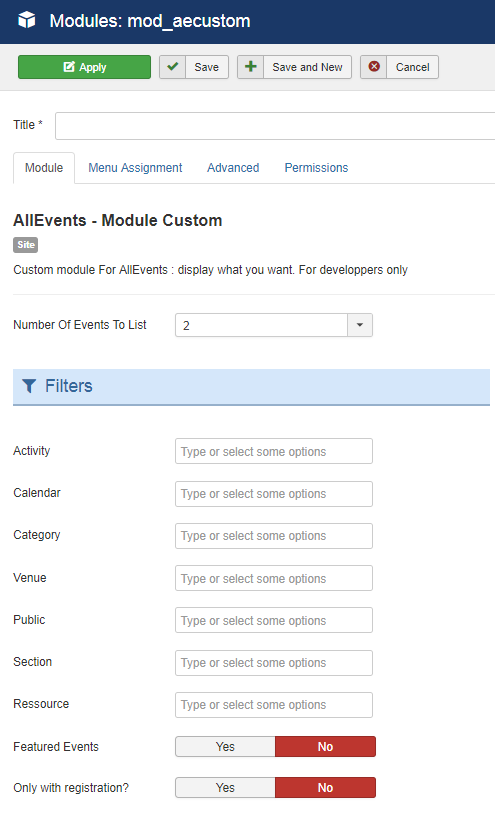

Custom module For AllEvents : display what you want. For developpers only

## Table of Contents
1. [Install the module](#install-the-module)
2. [Configure the module](#configure-the-module)
3. [My events are not displayed](#my-events-are-not-displayed)
4. [Frequently Asked Questions](#frequently-asked-questions)

**Why choose AllEvents Premium ?**

* Display your events friendly.
* View events via  multiple layout.
* User friendly interface.
* Full layout or Compact layout.
* ...

<a href="https://www.allevents3.com/en/our-products/product/mod_aecustom" role="button" class="btn btn-blue btn-lg" style="background:#46b8da;color:white">Download</a> or [Live Demo](https://www.allevents3.com/en/demo/mod_aecustom)

## Install the module
1. Download the extension to your local machine as a zip file package.
2. From the backend of your Joomla site (administration) select **Extensions >> Manager**, then Click the <b>Browse</b> button and select the extension package on your local machine. Then click the **Upload & Install** button to install module.
3. Go to **Extensions >> Module**, find and click on **AllEvents - Module Custom**. Then enable it.

! If you have problems installing or updating the extension, please try the manual installation process as described here: docs.joomla.org/Installing_an_extension

## Configure the module
Once you have created a new AllEvents module, you can quickly gain access to its customization options by visiting `Administrator -> Extensions -> Module Manager` and selecting your AllEvents module.

Creating a new module is a simple process, as well. You just navigate to the **Module Manager** and select **New** on the toolbar in the upper-left area of the page.

Below, we have outlined the options available to you as you configure your AllEvents module : 

### basic
| Option | Description | Value |
| ------ | ----------- | ----- |
|  Number Of Events To List | Number of events shown in the module | `1`, `2`, `3`, `4`, `5`, `6`, `7`, `8`, `9`, `10`, `11`, `12`, `13`, `14`, `15`, `16`, `17`, `18`, `19`, `20`(default:`2`)|

**Filters**

| Option | Description | Value |
| ------ | ----------- | ----- |
|  Activity | Choose an Activity. Without selection, `all` will be used. | |
|  Agenda | Choose an Agenda. Without selection, `all` will be used. | |
|  Category | Choose a Category. Without selection, `all` will be used. | |
|  Place | Choose a Place. Without selection, `all` will be used. | |
|  Public | Choose a Public. Without selection, `all` will be used. | |
|  Section | Choose a Section. Without selection, `all` will be used. | |
|  Resource | Choose a Resource. Without selection, `all` will be used. | |
|  Featured Events | Show only events designated as featured or `All`. | `Yes`, `No`|
|  Only with registration? | Show only events with at least one entry or `All` | `Yes`, `No`|

**Display of event's data**

| Option | Description | Value |
| ------ | ----------- | ----- |
|  Output format.This can be formatted as you like. |  You can add all the fields that an event has like: %link_start%, %link_end%, %line_break%, %id%, %title%, %location%, %category%, %start_date%, %start_time%, %end_date%, %end_time%, %description% | (default:``)|
|  Upcoming or Past Events | Select if you want to display upcoming or Past Events. | `Upcoming Events`, `Past Events`|
|  Text Alignment | This will apply the 'left', 'center' or 'right' style to the text element. | `Left`, `Center`, `Right`(default:`left`)|
|  Format date | To format the date use for example this code: d m Y. | (default:`d m Y`)|
|  Format time | To format the time use for example this code: H:i (only available at 2 rows view). | (default:`H:i`)|

### advanced

| Option | Description | Value |
| ------ | ----------- | ----- |
|  Layout | Use a layout from the supplied module or overrides in the templates. | |
|  Module Class Suffix | A suffix to be applied to the CSS class of the module. This allows for individual module styling. | |
|  Caching | Use the global cache setting to cache the content of this module or disable caching for this module. | `Use Global`, `No caching`(default:`1`)|
|  Cache Time | The time in seconds before the module is recached. | (default:`900`)|
|  cachemode |  | (default:`itemid`)|

## My events are not displayed

If you want to display the events on the AllEvents - Module Based on uikit, you should make sure that:
 
1. The module or plugin is published (obviously)
2. The module assigned to a visible module position. There can be many module positions listed for you to select, but make sure that the module position you select is visible in front-page.
3. The module is assigned to a menu. When you want to display a module on specific menus, you need to assign it to the menus.
4. the filters selected have events (obviously).
5. your entities filtred are published.

## Frequently Asked Questions
No questions for the moment
