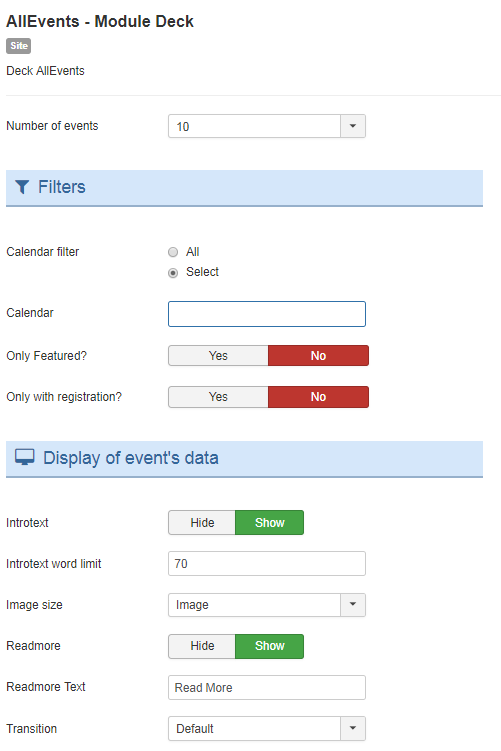

Deck AllEvents

## Table of Contents
1. [Install the module](#install-the-module)
2. [Configure the module](#configure-the-module)
3. [My events are not displayed](#my-events-are-not-displayed)
4. [Frequently Asked Questions](#frequently-asked-questions)

**Why choose AllEvents Premium ?**

* Display your events friendly.
* View events via  multiple layout.
* User friendly interface.
* Full layout or Compact layout.
* ...

<a href="https://www.allevents3.com/en/our-products/product/mod_aedeck" role="button" class="btn btn-blue btn-lg" style="background:#46b8da;color:white">Download</a> or [Live Demo](https://www.allevents3.com/en/demo/mod_aedeck)

## Install the module
1. Download the extension to your local machine as a zip file package.
2. From the backend of your Joomla site (administration) select **Extensions >> Manager**, then Click the <b>Browse</b> button and select the extension package on your local machine. Then click the **Upload & Install** button to install module.
3. Go to **Extensions >> Module**, find and click on **AllEvents - Module Deck**. Then enable it.

! If you have problems installing or updating the extension, please try the manual installation process as described here: docs.joomla.org/Installing_an_extension

## Configure the module
Once you have created a new AllEvents module, you can quickly gain access to its customization options by visiting `Administrator -> Extensions -> Module Manager` and selecting your AllEvents module.

Creating a new module is a simple process, as well. You just navigate to the **Module Manager** and select **New** on the toolbar in the upper-left area of the page.

Below, we have outlined the options available to you as you configure your AllEvents module : 

### basic
| Option | Description | Value |
| ------ | ----------- | ----- |
|  Number of events | Enter number of events you want to display in the module, default value is 5 and 5 events will be displayed. | `1`, `2`, `3`, `4`, `5`, `6`, `7`, `8`, `9`, `10`, `11`, `12`, `13`, `14`, `15`, `16`, `17`, `18`, `19`, `20` (default:`5`)|

**Filters**

| Option | Description | Value |
| ------ | ----------- | ----- |
|  Calendar filter |  | `All`, `Select`|
|  Calendar | Choose a Calendar. Without selection, `all` will be used. | |
|  Only featured ? |  | `Yes`, `No`|
|  Only with registration? |  | `Yes`, `No`|

**Display of event's data**

| Option | Description | Value |
| ------ | ----------- | ----- |
|  Introtext |  | `Hide`, `Show` (default:`1`)|
|  Introtext word limit | Leave blank to disable. If you enable this option, all html tags from the text will be cleaned up to make sure the html structure of the site does not brake. | (default:`70`)|
|  Image size |  | `Thumbnail`, `Image`(default:`XLarge`)|
|  Readmore | If set to Show, the 'Read more ...' link will show if Main text has been provided for an Event. | `Hide`, `Show`(default:`1`)|
|  Readmore Text |  | (default:`Read More`)|
|  Transition | Different types of Transition effects are available. You can using this parameter to get output like you want. | `Default`, `Fan right`, `Fan left`, `Fan right (asym.)`, `Fan left (asym.)`, `Rotated spread (horizontal)`, `Rotated spread (vertical)`, `Linear spread right`, `Linear spread left`, `Linear spread right (irregular)`, `Linear spread left (irregular)`, `Other1`, `Other2`, `Other3`, `Other4`|

### advanced

| Option | Description | Value |
| ------ | ----------- | ----- |
|  Module Class Suffix | A suffix to be applied to the CSS class of the module. This allows for individual module styling. | |
|  Caching | Use the global cache setting to cache the content of this module or disable caching for this module. | `Use Global`, `No caching`(default:`1`)|
|  Cache Time | The time in seconds before the module is recached. | (default:`900`)|
|  cachemode |  | (default:`static`)|

## My events are not displayed

If you want to display the events on the AllEvents - Module Based on uikit, you should make sure that:
 
1. The module or plugin is published (obviously)
2. The module assigned to a visible module position. There can be many module positions listed for you to select, but make sure that the module position you select is visible in front-page.
3. The module is assigned to a menu. When you want to display a module on specific menus, you need to assign it to the menus.
4. the filters selected have events (obviously).
5. your entities filtred are published.

## Frequently Asked Questions
No questions for the moment
