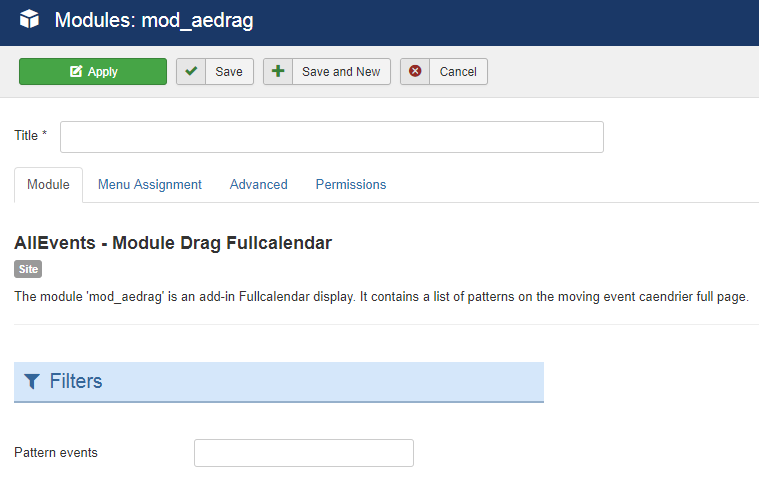

The module 'mod_aedrag' is an add-in Fullcalendar display. It contains a list of patterns on the moving event caendrier full page.

## Table of Contents
1. [Install the module](#install-the-module)
2. [Configure the module](#configure-the-module)
3. [My events are not displayed](#my-events-are-not-displayed)
4. [Frequently Asked Questions](#frequently-asked-questions)

**Why choose AllEvents Premium ?**

* Display your events friendly.
* View events via  multiple layout.
* User friendly interface.
* Full layout or Compact layout.
* ...

<a href="https://www.allevents3.com/en/our-products/product/mod_aedrag" role="button" class="btn btn-blue btn-lg" style="background:#46b8da;color:white">Download</a> or [Live Demo](https://www.allevents3.com/en/demo/mod_aedrag)

## Install the module
1. Download the extension to your local machine as a zip file package.
2. From the backend of your Joomla site (administration) select **Extensions >> Manager**, then Click the <b>Browse</b> button and select the extension package on your local machine. Then click the **Upload & Install** button to install module.
3. Go to **Extensions >> Module**, find and click on **AllEvents - Module Drag Fullcalendar**. Then enable it.

! If you have problems installing or updating the extension, please try the manual installation process as described here: docs.joomla.org/Installing_an_extension

## Configure the module
Once you have created a new AllEvents module, you can quickly gain access to its customization options by visiting `Administrator -> Extensions -> Module Manager` and selecting your AllEvents module.

Creating a new module is a simple process, as well. You just navigate to the **Module Manager** and select **New** on the toolbar in the upper-left area of the page.

Below, we have outlined the options available to you as you configure your AllEvents module : 

### basic

**Filters**

| Option | Description | Value |
| ------ | ----------- | ----- |
|  Pattern events | If you leave this parameter empty, no events will be displayed. If you want to display events, just enter the IDs of the events you want into this parameter, comma separated. For example, if you enter 2,6, events with ID = 2 or ID = 6 will be displayed. | |

## My events are not displayed

If you want to display the events on the AllEvents - Module Based on uikit, you should make sure that:
 
1. The module or plugin is published (obviously)
2. The module assigned to a visible module position. There can be many module positions listed for you to select, but make sure that the module position you select is visible in front-page.
3. The module is assigned to a menu. When you want to display a module on specific menus, you need to assign it to the menus.
4. the filters selected have events (obviously).
5. your entities filtred are published.

## Frequently Asked Questions
No questions for the moment
