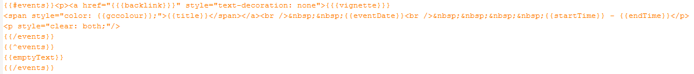

The module AllEvents - List allow to custom your own display with [Mustache](https://mustache.github.io/).

For example, the default template in "Mustache Upcoming" layout is : 

## Properties
Each event property list here can be called within the Event Display format controls. Properties can be wrapped in a double &#123;&#123;property&#125;&#125; or a triple &#123;&#123;&#123;property&#125;&#125;.  The double brackets return all of the HTML code made safe, while triple brackets allow HTML to be inserted and active in the display. The case of a property if **IMPORTANT**.

## Event Properties

|  Parameter  |  Description  |
|  :-----     |  :-----       |
| backlink    |  Event Link |
| description |  Event Description | 
| endDate     |  Event EndDate with date format | 
| endRaw      |  Event EndDate with 'YmdHis' Date format | 
| endTime     |  Event EndTime with time format | 
| eventDate   |  Event Date with date format | 
| eventDateJoin | Set in the administrator console, this is used to join the {{startDate}} and the {{endDate}} to create the {{eventDate}}. |  
| eventTime   |  Event Date with dateTime format. You can also use the {{startTime}}, {{endTime}} and the {{eventDateJoin}} to create a time description of the event (start to end.) | 
| gccolour    |  Back color defined in parameters | 
| location    |  Venue title | 
| startDate   |  Event Date with date format | 
| startRaw    |  Event Date with 'YmdHis' Date format | 
| startTime   |  Event Time with time format | 
| title       |  Event Title  | 
| vignette    |  Cover picture | 

## Event Management Properties

|  Parameter  |   Value (Default) |
|  :-----     |    :-----          |
|  eventLabel |   Set in the language files, the event label can then be displayed for each event. `MOD_AELIST_FIELD_CONFIG_EVENT_LABEL` ("Event") |    
|  calendarLinkLabel    | Set in the language files, the calendar link label can then be displayed to highlight the calendar link. `MOD_AELIST_FIELD_CONFIG_EVENT_LABEL_CALENDAR_BACK_LINK` ("<b>Go to calendar</b>") |
|  calendarNameLabel    |  Set in the language, the calendar name label can then be displayed to highlight the calendar name. `MOD_AELIST_FIELD_CONFIG_EVENT_LABEL_CALENDAR_NAME` ("Calendar") |
|  titleLabel |   Set in the language, the title label can then be displayed to highlight the event title. `MOD_AELIST_FIELD_CONFIG_EVENT_LABEL_EVENT_TITLE` ("Title") |
|  dateLabel |     Set in the language, the date label can then be displayed to highlight the event date. `MOD_AELIST_FIELD_CONFIG_EVENT_LABEL_WHEN` ("Date") |
|  attendeesLabel    |  `MOD_AELIST_FIELD_CONFIG_EVENT_LABEL_ATTENDEES` ("Attendees") |
|  locationLabel   |  Set in the language, the location label can then be displayed to highlight the event location. `MOD_AELIST_FIELD_CONFIG_EVENT_LABEL_LOCATION` ("Location") |
|  attachmentLabel    |  Set in the language, the attachment label can then be displayed to highlight the event attachments. `MOD_AELIST_FIELD_CONFIG_EVENT_LABEL_ATTACHMENT` ("Attachments") |
|  descriptionLabel    |  `MOD_AELIST_FIELD_CONFIG_EVENT_LABEL_DESCRIPTION` ("Description") |
|  authorLabel |     `MOD_AELIST_FIELD_CONFIG_EVENT_LABEL_AUTHOR` ("Author") |
|  copyLabel |    Set in the language, the copy label can then be displayed to highlight the event copy links. `MOD_AELIST_FIELD_CONFIG_EVENT_LABEL_COPY` ("Copy") |
|  copyGoogleLabel    |  Set in the language, the copy Google label can then be displayed to highlight the event link to copy to Google Calendar. `MOD_AELIST_FIELD_CONFIG_EVENT_LABEL_COPY_TO_MY_CALENDAR` ("Google Calendar") |
|  copyOutlookLabel    | Set in the language, the copy Google label can then be displayed to highlight the event link to copy to Google Calendar. `MOD_AELIST_FIELD_CONFIG_EVENT_LABEL_COPY_TO_MY_CALENDAR_ICS` ("iCal - Outlook") |
|  language |    'config.language' |
|  emptyText | Set in the language, the empty text label can then be displayed when no events are found to display. `MOD_AELIST_NO_EVENT` ("No events found") |