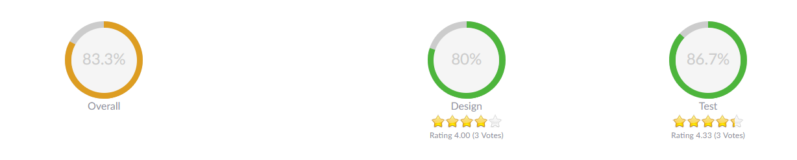
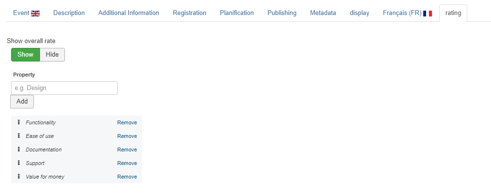

Provides Ajax Voting functionality to AllEvents Events and their Description

This functionnality is covered with 2 plugins : 
* AllEvents - AllEventsVote
* Ajax - AllEventsVote

## Table of Contents
1. [Install the plugin](#install-the-plugin)
2. [Configure the plugin](#configure-the-plugin)
3. [Frequently Asked Questions](#frequently-asked-questions)

In the header : 

In the footer :

## Install the plugins
1. Download the extension to your local machine as a zip file package.
2. From the backend of your Joomla site (administration) select **Extensions >> Manager**, then Click the <b>Browse</b> button and select the extension package on your local machine. Then click the **Upload & Install** button to install module.
3. Go to **Extensions >> Plugin**, find and click on **AllEvents - AllEventsVote**. Then enable it.
4. Go to **Extensions >> Plugin**, find and click on **Ajax - AllEventsVote**. Then enable it.

! If you have problems installing or updating the extension, please try the manual installation process as described here: docs.joomla.org/Installing_an_extension

For update the plugin you can follow [this topic](https://documentation.allevents3.com/allevents/installation/update).

For uninstall the plugin you can follow [this topic](https://documentation.allevents3.com/allevents/installation/uninstall).

## Configure the plugin
There are many options for you to customize your extension :
### [basic]
             
| Option | Description | Type | Value |
| ------ | ----------- | ---- | ----- |
|  {extravote #} Tag | Use {extravote #} tag for sub-content rating? | list | `Don't use`, `Replace always`, `Hide in blog views`(default:`Replace always`)|
|  {mainvote} Tag | Use {mainvote} special tag for main content rating? | list | `Don't use`, `Replace always`, `Hide in blog views`(default:`Replace always`)|
|  Average Rating | Show/Hide average rating | list | `Hide`, `Show`, `Show only on Mainvote`, `Show only on Extravotes`(default:`Show`)|
|  Average mode | Select how the average should be calculated | radio | `Percent`, `Out of five`(default:`Out of five`)|
|  Votes Counter | Show/Hide votes counter | list | `Hide`, `Show`, `Show only on Mainvote`, `Show only on Extravotes`(default:`Show`)|
|  Show/Hide (0 Votes) | Show/Hide (0 Votes) for unrated items? | radio | `Show`, `Hide`(default:`Show`)|
|  Initially Hide Counter? | Hide Counter and Current Rating until the user votes | radio | `Yes`, `No`|
|  Enable Half Stars | Enable half stars for rating | radio | `Yes`, `No`(default:`Yes`)|
|  Rating Access | Public or registered rating access | radio | `Public`, `Registered`(default:`Public`)|
|  Load AllEventVote Style | Load AllEventVote stylesheet | radio | `Yes`, `No`(default:`Yes`)|
|  Stars Size | Choose your Stars Size | list | `Big`, `Medium`, `Small`(default:`Big`)|

## Configure the rates
In the backend, in the event's edition mode, you can definied your scores : 

## Frequently Asked Questions

**Is it compatible with Rich Snippets ?**
yes, The votes for your event will be retrieved as a specific **aggregateRating** section in the JSON-LD information in the [AllEvents - Rich Snippets plugin](https://documentation.allevents3.com/allevents-plugins/allevents-rich-snippets)
> "aggregateRating": {
>
>    "@type": "AggregateRating",
>   
>    "ratingValue": "4",
>    
>    "reviewCount": "3077"
>    
> },
