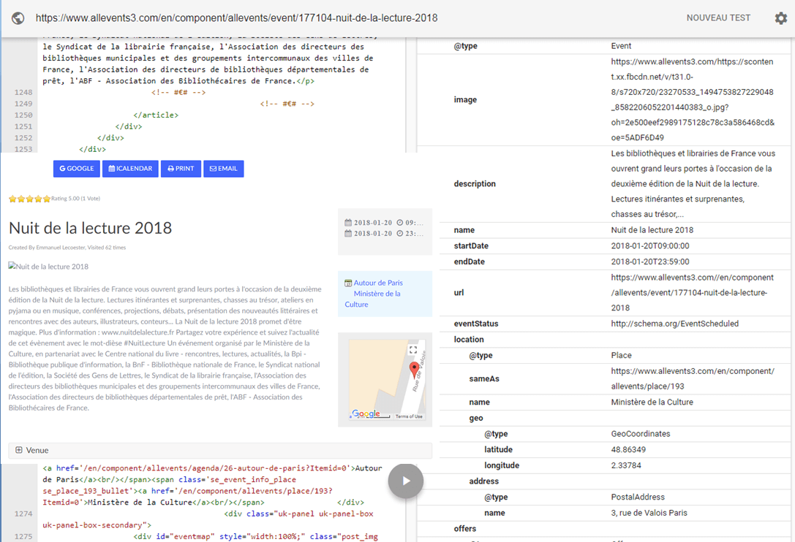

Adding Rich Snippets meta information to your events (used by Google). We present these structured data ("rich snippets") with the JSON-LD tag.

!!!! You can test your page with the [testing-tool](https://developers.google.com/structured-data/testing-tool/) proposed by google

## Table of Contents
1. [Install the plugin](#install-the-plugin)
2. [Configure the plugin](#configure-the-plugin)
3. [AllEvents RichSnippets Data](#allevents-richsnippets-data)
4. [Frequently Asked Questions](#frequently-asked-questions)

    
## Install the plugin
1. Download the extension to your local machine as a zip file package.
2. From the backend of your Joomla site (administration) select **Extensions >> Manager**, then Click the <b>Browse</b> button and select the extension package on your local machine. Then click the **Upload & Install** button to install module.
3. Go to **Extensions >> Plugin**, find and click on **AllEvents - Rich Snippets**. Then enable it.

! If you have problems installing or updating the extension, please try the manual installation process as described here: docs.joomla.org/Installing_an_extension

For update the plugin you can follow [this topic](https://documentation.allevents3.com/allevents/installation/update).

For uninstall the plugin you can follow [this topic](https://documentation.allevents3.com/allevents/installation/uninstall).

## Configure the plugin
There is no option for customize your extension.

## AllEvents RichSnippets Data

### Place page
Display a place **with** latitude and longitude

	{
		"@context": "http://schema.org",
		"@type" : "Place",
		"sameAs" : "Place URL on your Website",
		"name" : "Place Title",
		"geo": {
			"@type": "GeoCoordinates",
			"latitude": "Place latitude",
			"longitude": "Place longitude"
		},
		"address" : "Place Adress"
	}

Display a place **without** latitude and longitude

	{
		"@context": "http://schema.org",
		"@type" : "Place",
		"sameAs" : "Place URL on your Website",
		"name" : "Place Title",
		"address" : "Place Adress"
	}

### Event page

1. The **location** subset is displayed only when a venue (place / location) is defined for the event.
2. The **geo** subset is displayed only when a venue (place / location) is defined for the event with latitude and longitude.
3. For a whole day, Event Start Date and Event End Date will be in Date Format. In the other case, in DateTime format.
4. The **image** data will be represented by Banner / Poster (if no banner) / Thumbnail (if no poster) picture of your event.
5. If the enrolments are enabled for the event and event is not full, **avaibility** = InStock. In the other case, SoldOut.

Display an event:

	{
		"@context": "http://www.schema.org",
		"@type": "Event",
		"name": "Event Title",
		"url": "Event URL on your website",
		"description": "Event Description (first 200 characters)",
		"startDate": "Event Start Date",
		"endDate": "Event End Date",
		"location": {
			"@type": "Place",
			"name": "Place Title",
			"sameAs": "Place URL on your Website",
			"geo": {
				"@type": "GeoCoordinates",
				"latitude": "Place latitude",
				"longitude": "Place longitude"
			},
			"address" : "Place Adress"
		},
        "image": "Event Image",
		"eventStatus" : "EventScheduled",
        "offers": {
			"@type": "Offer",
			"availability": "Event avaibility",
        	"name": "General Admission",
			"url": "Event URL",
			"priceCurrency": "EUR",
			"price": "Event price"
		}
	}

### Events page
Display an array of [event's data RichSnippets](https://documentation.allevents3.com/allevents-plugins/allevents-rich-snippets#event-page).

## Frequently Asked Questions
### In which pages ?
AllEvents - Rich Snippets is provide in the event page, list events page, venues pages.
