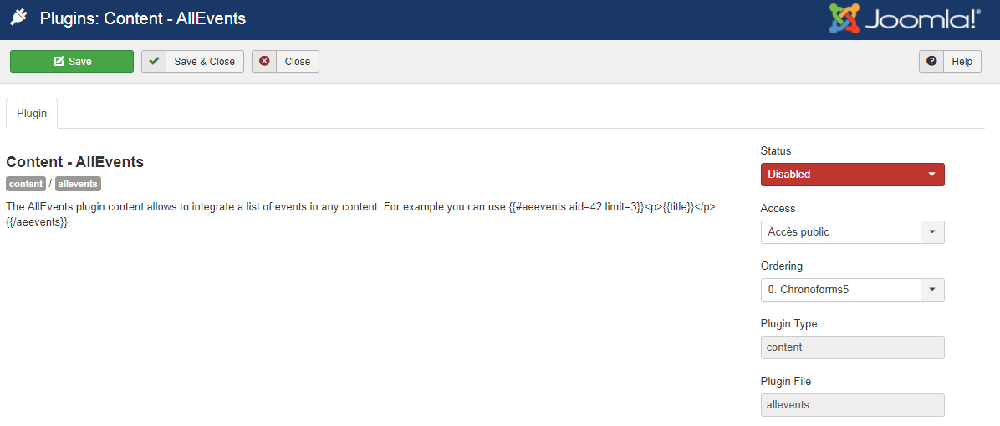

The AllEvents plugin content allows to integrate a list of events in any content.

## Table of Contents
1. [Install the plugin](#install-the-plugin)
2. [Configure the plugin](#configure-the-plugin)
	
## Install the plugin
1. Download the extension to your local machine as a zip file package.  (direct link : [content_allevents](https://www.allevents3.com/en/joomla-extensions/addons/content_allevents))
2. From the backend of your Joomla site (administration) select **Extensions >> Manager**, then Click the <b>Browse</b> button and select the extension package on your local machine. Then click the **Upload & Install** button to install module.
3. Go to **Extensions >> Plugin**, find and click on **Content - AllEvents**. Then enable it.

! If you have problems installing or updating the extension, please try the manual installation process as described here: docs.joomla.org/Installing_an_extension

## Configure the plugin
There is no specific option to customize your extension.
