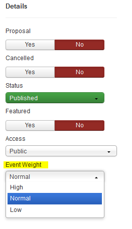

You can manage several events in the same day and you want to highlight a specific one. Since the 3.3.4 version you can add a weighting to your events :

1. low
2. normal
3. high

When two events are placed on the same day, the one that the highest weighting will be used to color the box of the day.
