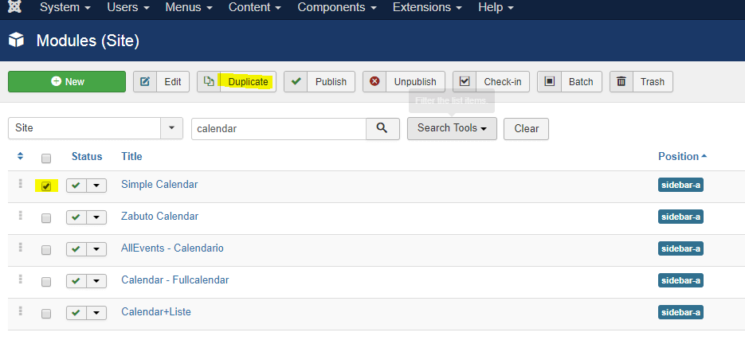
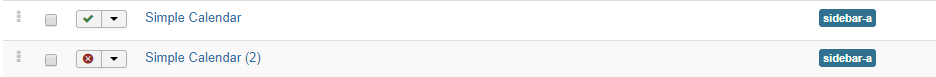

In some situations, you may want to copy a AlLEvents module. This could be a case when you decide to user the same filters in different modules proposed.

Or you may opt to display the same module on different pages in different visual styles. That's where you will have to create more than one instance of the module and assign each of its instances to its own page.

You copy an AllEvents module the same way you copy any Joomla module.

In your Joomla administrator top menu, go to **Extensions > Modules** 
1. Click on the checkbox to the left of the module status
2. Click Duplicate
 

3. You will now see a second copy of the module:

There you have it. Click on the duplicate module title to edit and publish it according to your Joomla site requirements.