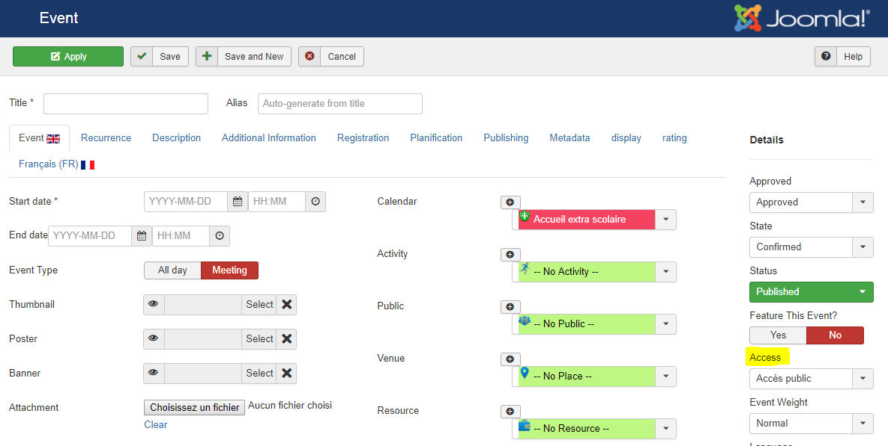

Private events in AllEvents are events that are hidden from public eye. By default, only registered and logged in users of your site will be able to view them.

Use this feature if you plan to display some of your AllEvents events to the public, and others - only internally, to your team.

To make an event Private : 
1. Open up the event for editing
2. Set the Access parameter to Private
3. Click Save. 

