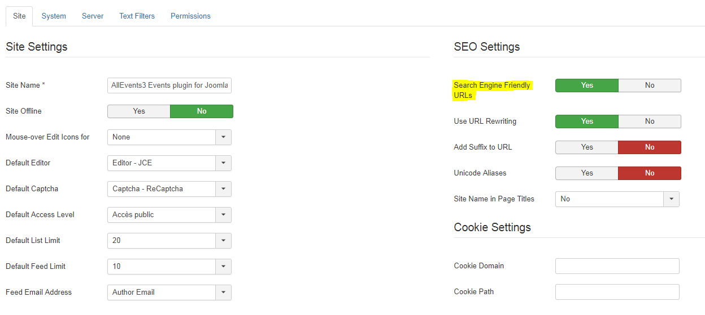

When you install AllEvents component and populate it with events, your events calendar front end page URL may look like following:

http://domain.com/index.php?option=com_allevents&view=events&layout=map&Itemid=123

To you site visitor, this URL looks rather cryptic. To search engines it looks as non-optimized.

AllEvents generates search engine friendly (SEF) URLs using the corresponding Joomla core SEO settings.

* In your Joomla administrator top menu, go to System > Global Configuration
* Make sure you set the Search Engine Friendly URLs and Use URL Rewriting parameters to Yes

* Now refresh your AllEvents map page. Its URL should now look compact and friendly to both your visitors and search engines:
http://domain.com/events-map