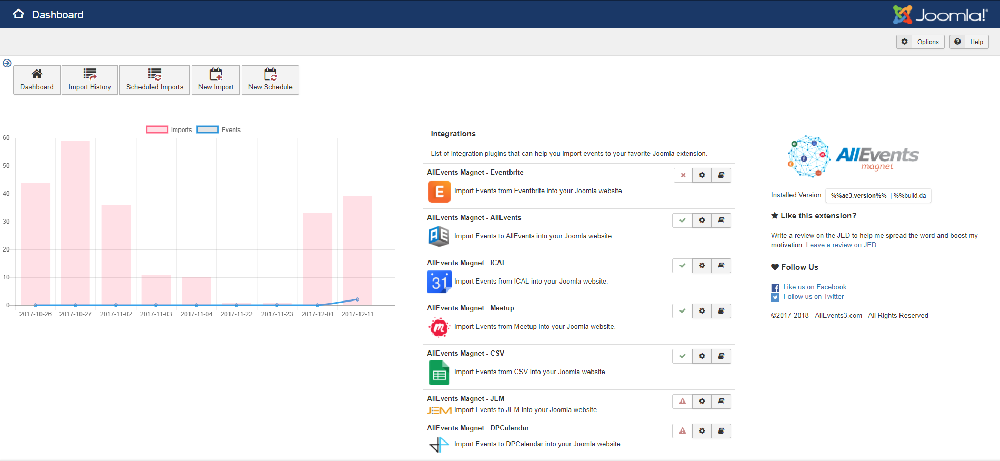

On the Control Panel or Dashboard, you have : 

On the **top**, you can open : 
* the Imports history
* the Imports Scheduled history
* the Import's Creation
* the Import's Scheduled Creation

On the **left**, you can find your history of event's imports.

In the **middle** you can find a list of plugins installed and their state : 
* <i class="fa fa-check text-success"></i> published and external component installed
* <i class="fa fa-times text-error"></i> not published and external component installed
* <i class="fa fa-exclamation-triangle text-error"></i> external component not installed 

For each plugin, you have a button to our documentation

On the **right** you can find some information about our component.
