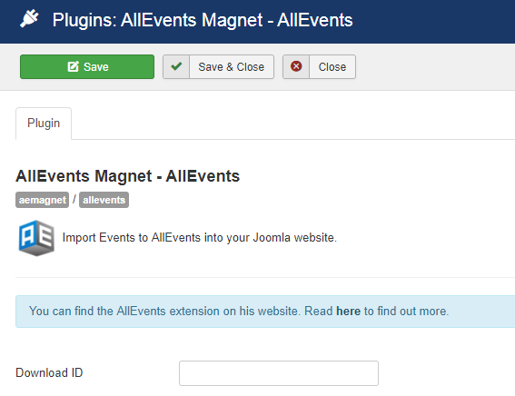

The "AllEvents Magnet – AllEvents" plugin integrates events into AllEvents solution by AllEvents Magnet through a specific plugin. 

## Table of Contents
1. [Install the plugin](#install-the-plugin)
2. [Configure the plugin](#configure-the-plugin)
3. [Frequently Asked Questions](#frequently-asked-questions)

## Install the plugin
1. Download the extension to your local machine as a zip file package.
2. From the backend of your Joomla site (administration) select **Extensions >> Manager**, then Click the <b>Browse</b> button and select the extension package on your local machine. Then click the **Upload & Install** button to install module.
3. Go to **Extensions >> Plugin**, find and click on **AllEvents Magnet – AllEvents **. Then enable it.

! If you have problems installing or updating the extension, please try the manual installation process as described here: docs.joomla.org/Installing_an_extension

For update the plugin you can follow [this topic](https://documentation.allevents3.com/allevents/installation/update).

For uninstall the plugin you can follow [this topic](https://documentation.allevents3.com/allevents/installation/uninstall).

## Configure the plugin

            
| Option | Description | Type | Value |
| ------ | ----------- | ---- | ----- |
|  Download ID | Enter your Download ID to enable Updates | text | (default:``)|
| Update Description |Facebook propose the description only in plain text. So if you set update events on Yes, the description will loose their format if you change it. | checkbox | |

## Frequently Asked Questions
### Which data in insert mode ?
These data were created when the event (identified by external UID) not exists:
* title       
* alias
* date        
* enddate     
* allday      
* calendar
* activity 
* category
* public   
* resource
* section
* description 
* proposed_by 
* image
* attribs (metadata)
* status

### Which data in update mode ?
These data were updated when the event (identified by external UID) already exists:
* title   
* date        
* enddate     
* allday  (true if date = enddate)
* calendar   
* activity 
* category
* public
* resource
* section
* description 
* image

