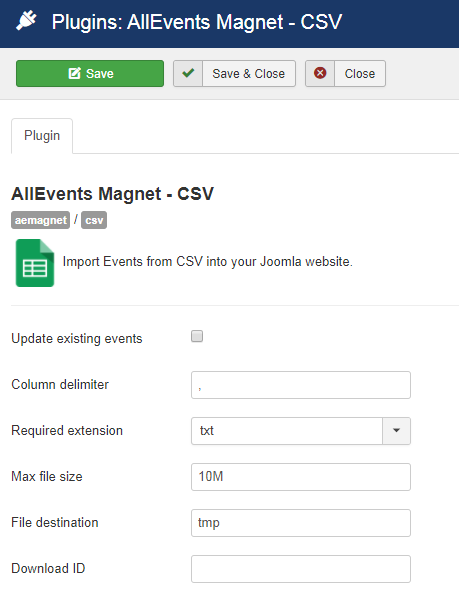

 
The "AllEvents Magnet – CSV" plugin integrates events from CSV file into AllEvents Magnet through a specific plugin. 

## Table of Contents
1. [Install the plugin](#install-the-plugin)
2. [Configure the plugin](#configure-the-plugin)
3. [Frequently Asked Questions](#frequently-asked-questions)

**Supported Event Fields:**
* Publish status
* Event name
* Event description
* Event start & end time and date
* All day events
* Featured image
* Event URL
* Event type category

## Install the plugin
1. Download the extension to your local machine as a zip file package.
2. From the backend of your Joomla site (administration) select **Extensions >> Manager**, then Click the <b>Browse</b> button and select the extension package on your local machine. Then click the **Upload & Install** button to install module.
3. Go to **Extensions >> Plugin**, find and click on **AllEvents Magnet – CSV **. Then enable it.

! If you have problems installing or updating the extension, please try the manual installation process as described here: docs.joomla.org/Installing_an_extension

For update the plugin you can follow [this topic](https://documentation.allevents3.com/allevents/installation/update).
For uninstall the plugin you can follow [this topic](https://documentation.allevents3.com/allevents/installation/uninstall).

## Configure the plugin

### [basic]
There are many options for you to customize your extension :
             
| Option | Description | Type | Value |
| ------ | ----------- | ---- | ----- |
|  Update existing events | Check to updates existing events. (Not Recommend) | checkbox | |
|  Column delimiter | If your CSV file uses a separator character other than a comma, specify that character. | text | (default:`,`)|
|  Required extension |  | list | `txt`, `csv`(default:`csv`)|
|  Max file size | Note that 'maxFileSize' will not affect post_max_size or upload_max_filesize as is set in php.ini.  Having a maxFileSize that exceeds either will still result in errors that prevent the file upload. | text | (default:`10M`)|
|  File destination |  | text | (default:`tmp`)|
|  Download ID | Enter your Download ID to enable Updates | text | |

## CSV Import
AllEvents Magnet allows you to Import events from CSV file : Events, Venues, Organizers.

### CSV Events File Import

The following event fields can be imported via a CSV file:

|FIELD NAME	|EXAMPLE DATA	|FIELD TYPE|	NOTES
| --- | --- | --- | --- |
| EVENT NAME | | String|  |
| EVENT DESCRIPTION | | html |  |
| START DATE |2017-11-16 | Date| Example is for an event on Novemeber 16st, 2017. |
| START TIME |19:30:00 | Time|The time of day that the event starts. Example is for an event starting at 7:30pm.  |
| END DATE | 2018-01-01	| Date| Example is for an event ending on January 1st, 2018. |
| END TIME |00:50:00	 | Time| The time of day that the event ends. Example is for an event ending at 12:50am. |
| ALL DAY EVENT? |false | Boolean| When true the event is treated as lasting all day from the beginning of the Start Date to the end of the End Date. The Start/End Time fields are essentially ignored and can be left blank. |
| TIMEZONE |Europe/Paris	 | String| his should be a valid Timezone string. Timezones can be represented in numerous acceptable ways. You can find a list of acceptable timezones sorted by continent [here](http://php.net/manual/en/timezones.php). |
| EVENT WEBSITE |https://allevents3.com |URL |  |
| EVENT IMAGE | https://allevents3.com/mypicture.png | URL| This should be a direct URL to the image. |
| EVENT CATEGORY |Museum  | String|  The example puts this event in the Museum category.| 

> Download Event Example File

> TODO

### CSV Venues File Import
Structure
> TODO

### CSV Organizers File Import
Structure
> TODO

### Scheduled Imports
**NO scheduled** imports for CSV File

### Manage Scheduled Imports
**NO scheduled** imports for CSV File

### What to check if CSV importer not working
1. Check if data formats are correct
2. Use double quotes to enclose all textual data.
2. Check CSV file: Open the CSV file with notepad or another text editor program and make sure you have the good character delimited data in there (separated by commas)
3. Try to import few events to check.