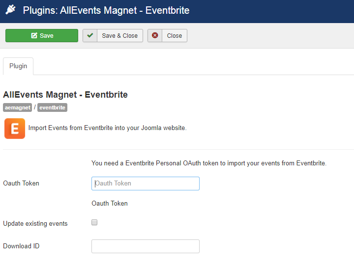

 
The "AllEvents Magnet – Eventbrite" plugin integrates events from Eventbrite into AllEvents Magnet through a specific plugin. 

## Table of Contents
1. [Install the plugin](#install-the-plugin)
2. [Configure the plugin](#configure-the-plugin)
3. [Eventbrite Import](#eventbrite-import)

## Install the plugin
1. Download the extension to your local machine as a zip file package.
2. From the backend of your Joomla site (administration) select **Extensions >> Manager**, then Click the <b>Browse</b> button and select the extension package on your local machine. Then click the **Upload & Install** button to install module.
3. Go to **Extensions >> Plugin**, find and click on **AllEvents Magnet – Eventbrite **. Then enable it.

! If you have problems installing or updating the extension, please try the manual installation process as described here: docs.joomla.org/Installing_an_extension

For update the plugin you can follow [this topic](https://documentation.allevents3.com/allevents/installation/update).
For uninstall the plugin you can follow [this topic](https://documentation.allevents3.com/allevents/installation/uninstall).

## Configure the plugin
You are also going to need to know Eventbrite Personal OAuth token.You can obtain these keys by visiting the eventbrite.com website by login.

> screen 1

You have to click on dropdown button and choose account settings from dropdown.

> screen 2****

As per above screenshot ,find **App Management** towards the bottom of the lefthand sidebar.Click on **App Management** you  see your **App name**.

> screen 3

### [basic]

**You need a Eventbrite Personal OAuth token to import your events from Eventbrite.**
| Option | Description | Type | Value |
| ------ | ----------- | ---- | ----- |
|  Oauth Token |  | text | |
|  Update existing events |   | checkbox | |
|  Download ID | Enter your Download ID to enable Updates | text | |

## Eventbrite Import
Import Eventbrite Events plugin is import Eventbrite ( eventbrite.com ) events on your site.This Plugin is works as a stand alone as well as add-on plugin for below listed Events plugins, which allows you to run imports from eventbrite right from your dashboard. As a stand alone plugin this plugin work independently for event import and Event Management.

### Import by Eventbrite Event ID
> screen

* **Import by**: You choose Eventbrite Event Id from dropdown for import event by Eventbrite Event ID.
* **Eventbrite Event Id**: you want to enter the id of Eventbrite event.
* **Import into**: you can choose your events component from dropdown list.
* **Import type**: you import event based on one-time or scheduled import.

### Import Your Eventbrite Events
> screen

* **Import by**: If you choose import by Your Events then your event from your eventbrite account import in events.
* **Import into**: you can choose your events component from dropdown list.
* **Import type**: you import event based on one-time or scheduled import.

### Import by Eventbrite Organiser ID
> screen

* **Import by**:If you are importing from someone else’s Eventbrite account, then you can use this option to import the event using the Organizer ID number of the event. The ID number for an event is the string of numbers located in the Eventbrite.com URL for an event.
* **Eventbrite Organizer ID**: you can get Event ID from eventbrite.com.
* **Import into**: you can choose your events component from dropdown list.
* **Import type**: you import event based on one-time or scheduled import.

### Scheduled Imports
Some possibilities are proposed. You can find them on the specific page [Scheduled Imports](https://documentation.allevents3.com/allevents-magnet-administration/scheduled-imports)

### Manage Scheduled Imports
Some possibilities are proposed. You can find them on the specific page [Manage Scheduled Imports](https://documentation.allevents3.com/allevents-magnet-administration/manage-scheduled-import)
