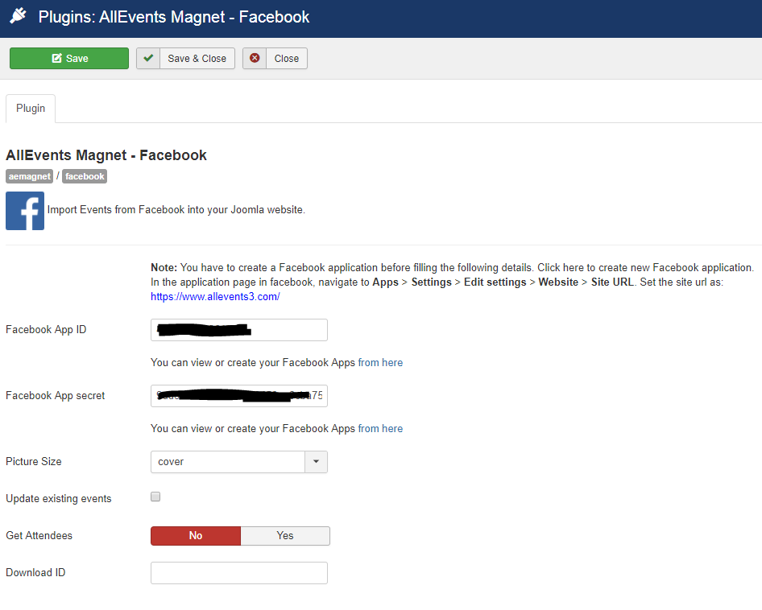
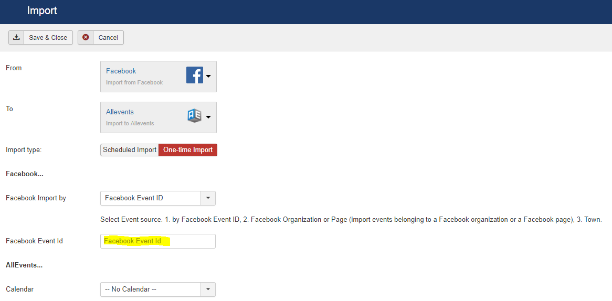
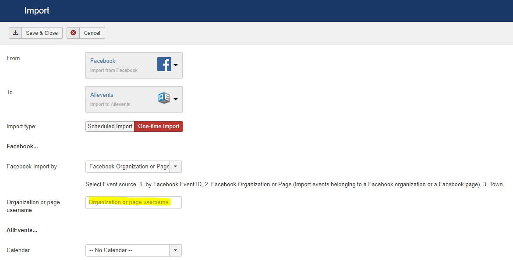
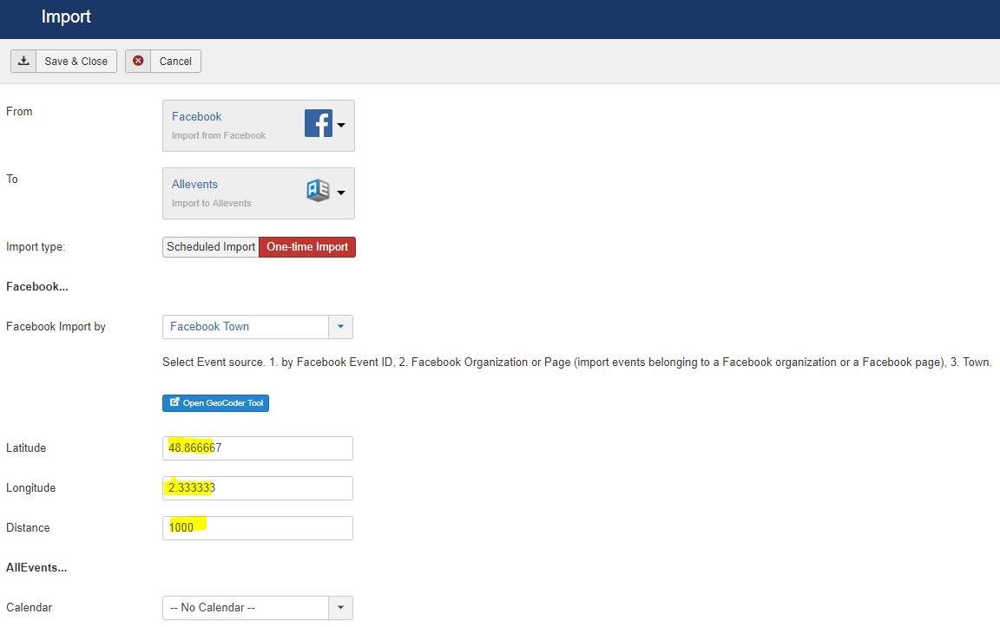
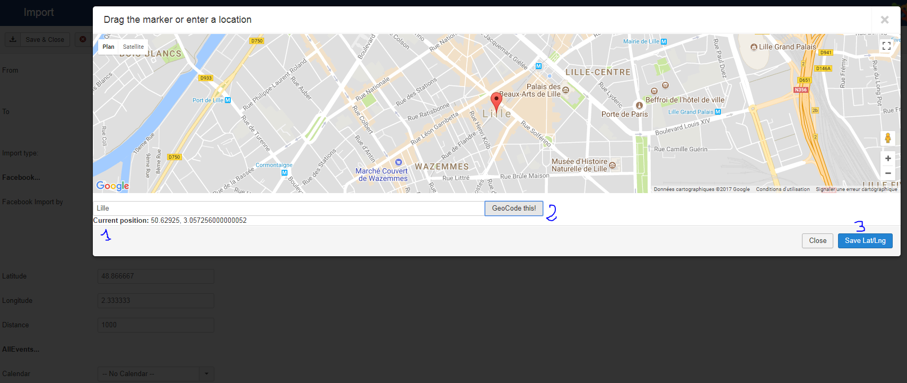

 
The "AllEvents Magnet – Facebook" plugin integrates events from Facebook into AllEvents Magnet through a specific plugin.

## Table of Contents
1. [Install the plugin](#install-the-plugin)
2. [Configure the plugin](#configure-the-plugin)
3. [Facebook Import](#facebook-import)
4. [Frequently Asked Questions](#frequently-asked-questions)

## Install the plugin
1. Download the extension to your local machine as a zip file package.
2. From the backend of your Joomla site (administration) select **Extensions >> Manager**, then Click the <b>Browse</b> button and select the extension package on your local machine. Then click the **Upload & Install** button to install module.
3. Go to **Extensions >> Plugin**, find and click on **AllEvents Magnet – Facebook **. Then enable it.

! If you have problems installing or updating the extension, please try the manual installation process as described here: docs.joomla.org/Installing_an_extension

For update the plugin you can follow [this topic](https://documentation.allevents3.com/allevents/installation/update).
For uninstall the plugin you can follow [this topic](https://documentation.allevents3.com/allevents/installation/uninstall).

## Configure the plugin
### Getting your API key
You need to follow the steps on this page : [Creating an App ID - App Development - Facebook for Developers](https://developers.facebook.com/docs/apps/register)

### Setting up your API key
Go to the plugin manager in the Joomla administration back end, edit the  **AllEvents Magnet – Facebook ** plugin and update the Facebook App data.
### Basic

| Option | Description | Type | Value |
| ------ | ----------- | ---- | ----- |
|  Facebook App ID | You can view or create your Facebook Apps [https://developers.facebook.com/apps](https://developers.facebook.com/apps) | text | |
|  Facebook App secret | You can view or create your Facebook Apps [https://developers.facebook.com/apps](https://developers.facebook.com/apps)  | text | |
| Allowed FB categories | You can filter events by town for few categories | list | `FITNESS_RECREATION`, `ARTS_ENTERTAINMENT`, `EDUCATION`, `FITNESS_RECREATION`, `FOOD_BEVERAGE`, `HOTEL_LODGING`, `MEDICAL_HEALTH`, `SHOPPING_RETAIL`, `TRAVEL_TRANSPORTATION` (default:``)|
|  Update existing events |   | checkbox | |
|  Get Attendees | Users declined, attending, maybe for event | radio | `No`, `Yes`|
|  Download ID | Enter your Download ID to enable Updates | text | |

### Images management
| Option | Description | Type | Value |
| ------ | ----------- | ---- | ----- |
| Poster | You can use this to get a pre-specified size of picture. | list | `cover`, `small`, `normal`, `album`, `large`, `square` (default:`large`)|
| Thumbnail | You can use this to get a pre-specified size of picture. | list | `cover`, `small`, `normal`, `album`, `large`, `square` (default:`small`)|
| Resize Images |  | checkbox | `No`, `Yes`(default: `No`)|
| Graphic Library | Graphic Library to use in the image processing (check in the Test Libraries tab witch libraries are available on you server) | list | `Imagick Shell Execute`, `PHP Imagick Class`, `JImage (GD)` |
| Shell Execute Path | Path to the ImageMagick convert command (necessary only if you use Imagick Shell Execute processing - eg. convert or /usr/bin/convert); | text | (default: `convert`)|
| Cache Folder | Folder where to save images after the processing | text | (default: `images/cache`)|
| Default Size Poster | Default size to be applied to each image for a Poster image | text | (default: ``)|
| Default Size Thumbnail | Default size to be applied to each image for a Thumbnail image | text | (default: ``)|

### Image Definitions
You can define multiple options to apply in any image process import. A set of options is defined in the following form:

**opt1**=_val1_, **opt2**=_val2_, **optN**=_valN_

For each image type in event, you can define the following options:
* **w**: image width in pixel;
* **h**: image height in pixel;
* **crop**: it the aspect ratio w/h of the resized image is different from that of the original image, adjust the new image avoiding white spaces*;
* **maxOnly**: resize with new values w and h only if the original image is larger than the resultant one (avoid the "grainy" effect when the image is already at its maximum size);
* **quality**: the quality of the resized image (from 0 to 100, default: 90).
 
!!! Applying **w** and **h** options together without **crop** options can generate different results according to the used library (Imagick Shell Execute applies black bands in the leftover space, PHP Imagick Class stretches the image while JImage (GD) only considers the lower value between w and h). So generally the best practice is to indicate only one of the w or h parameter or else, if you want to set both parameters, it is recommended to apply also the crop option, avoiding unwanted results.

Examples : 
* w=650, maxOnly=TRUE
* w=600, h=180, crop=TRUE

### Test Librairies
Tests for information 

## Facebook Import

Import Facebook Events allows you to import facebook events into your Joomla site automatically. Automate your Event Marketing using Import Facebook Events plug-in. Import Events from Facebook Page, Facebook Event or Facebook Organizations page.

!!!! **Facebook recursive event support** : A recurrent event will be attracted and an event for each date will be created.

!!!  Importing via the Event or Events feed page will not sync the featured image for the event — this is a technological limitation of Facebook.

### Import by Facebook Event ID

Import a **single Event**.

* **Import by**: You choose Facebook Event Id from dropdown for import event by **Facebook Event ID**.
* **Facebook Event Id**: you want to enter the id of facebook event.
* **Import into**: you can choose your events component from dropdown list.
* **Import type**: you import event based on one-time or scheduled import.

### Import by Facebook Organization or Page

Import all events from **Page** or import all events from **Group** (import from the calendar tab for group pages). 

* **Import by**: if you choose **Facebook Organization or Page**.
* **Organization and Page username**: you want to enter username or id to fetch events from that page.
* **Import into**: you can choose your events component from dropdown list.
* **Import type**: you import event based on one-time or scheduled import.

### Import by Facebook Town

* **Import by**: If you want to import nearby eventsof a town, choose **Facebook Town**
* **Import into**: you can choose your events component from dropdown list.
* **Import type**: you import event based on one-time or scheduled import.
* **Latitude**: The latitude of the position/coordinate the events shall be returned for
* **Longitude**: The longitude of the position/coordinate the events shall be returned for
* **Distance**: The distance in meters (it makes sense to use smaller distances, like max. 2500)

!! Resize Images is not available in Import by Facebook Town mode

To help you to determine the position/coordinate of the town, you have a button <a role="button" class="btn btn-mini btn-primary" data-toggle="modal">Open GeoCoder Tool</a>

In this modal window, you can define the town in (1), and click to geocode this (2). Finally, you can save these coordinates with the save button (3).

### Scheduled Imports
Some possibilities are proposed. You can find them on the specific page [Scheduled Imports](https://documentation.allevents3.com/allevents-magnet-administration/scheduled-imports)

### Manage Scheduled Imports
Some possibilities are proposed. You can find them on the specific page [Manage Scheduled Imports](https://documentation.allevents3.com/allevents-magnet-administration/manage-scheduled-import)

## Frequently Asked Questions
### Do my Facebook events get updated on a schedule?
Yes, You can choose the scheduled interval and also update immediately when you press the 'Update' button from the Scheduled Imports page within settings.

### What are the Facebook App ID and App Secret, and why are they required?
The Facebook App ID and App Secret are required by Facebook to access data via the Facebook graph API. 

### Why can’t I see any events on my page?
Check if you have entered the right state (published or not) for your events. Check also if you have any filter for your events

### Why the description is in plain text ?
For the moment, the event's description can be read only in plain text. So the description is without any new line, paragraph, link... (for more information you can read the official documentation [graph-api-event](https://developers.facebook.com/docs/graph-api/reference/v2.4/event)

### I have the error "(#102) A user access token is required to request this resource."
You have the rights to read this page but you can't manage events on this page.

### I have the error "(#803) Cannot query users by their username (****)"
You can't access on a page's events by the username. You must be set the ID of this page. You can test this page to obtain the ID : [Looking for your Facebook profile ID / Group ID / Page ID](http://lookup-id.com/#)