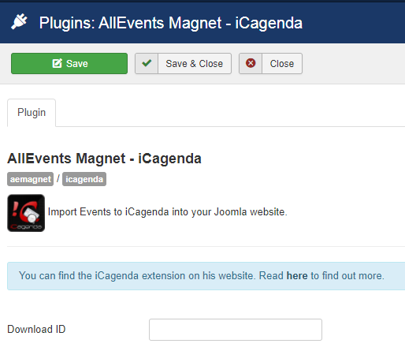

 
The "AllEvents Magnet – iCagenda" plugin integrates events into iCagenda solution by AllEvents Magnet through a specific plugin. 
!! <i class="fa fa-exclamation-triangle" aria-hidden="true"></i> AllEvents Magnet is not affiliated with or endorsed by the iCagenda Project ([https://www.joomlic.com/](https://www.joomlic.com/)).

## Table of Contents
2. [Install the plugin](#install-the-plugin)
4. [Configure the plugin](#configure-the-plugin)
5. [Frequently Asked Questions](#frequently-asked-questions)
	
## Install the plugin
1. Download the extension to your local machine as a zip file package.
2. From the backend of your Joomla site (administration) select **Extensions >> Manager**, then Click the <b>Browse</b> button and select the extension package on your local machine. Then click the **Upload & Install** button to install module.
3. Go to **Extensions >> Plugin**, find and click on **AllEvents Magnet – iCagenda **. Then enable it.

! If you have problems installing or updating the extension, please try the manual installation process as described here: docs.joomla.org/Installing_an_extension

For update the plugin you can follow [this topic](https://documentation.allevents3.com/allevents/installation/update).
For uninstall the plugin you can follow [this topic](https://documentation.allevents3.com/allevents/installation/uninstall).

## Configure the plugin

### [basic]
             
| Option | Description | Type | Value |
| ------ | ----------- | ---- | ----- |
|  Download ID | Enter your Download ID to enable Updates | text | (default:``)|

## Frequently Asked Questions
### Which data in insert mode ?
These data were created when the event (identified by external UID) not exists:
* title    
* startdate
* enddate  
* all_day  
* category (_catid_)
* description (_desc_)
* params   
* image    

### Which data in update mode ?
These data were updated when the event (identified by external UID) already exists:
* title     
* startdate 
* enddate   
* all_day   
* category (_catid_)
* description (_desc_)
* image       
