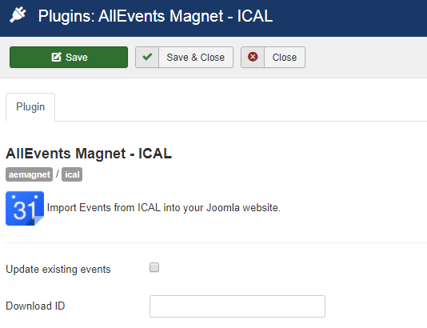

 
The "AllEvents Magnet – iCal" plugin integrates events from iCal file or URL into AllEvents Magnet through a specific plugin. 

How to obtain an .ics File ? Here are some examples: [Apple Calendar](https://support.apple.com/fr-fr/guide/calendar/import-or-export-calendars-icl1023), [Google Calendar](https://support.google.com/calendar/answer/37111?hl=en&topic=1672003&ctx=topic)

## Table of Contents
1. [Install the plugin](#install-the-plugin)
2. [Configure the plugin](#configure-the-plugin)
3. [iCal Import](#ical-import)
	
## Install the plugin
1. Download the extension to your local machine as a zip file package.
2. From the backend of your Joomla site (administration) select **Extensions >> Manager**, then Click the **Browse** button and select the extension package on your local machine. Then click the **Upload & Install** button to install module.
3. Go to **Extensions >> Plugin**, find and click on **AllEvents Magnet – iCal **. Then enable it.

! If you have problems installing or updating the extension, please try the manual installation process as described here: docs.joomla.org/Installing_an_extension

For update the plugin you can follow [this topic](https://documentation.allevents3.com/allevents/installation/update).
For uninstall the plugin you can follow [this topic](https://documentation.allevents3.com/allevents/installation/uninstall).

## Configure the plugin

There is one options for you to customize your extension :
             
| Option | Description | Type | Value |
| ------ | ----------- | ---- | ----- |
|  Update existing events |  | checkbox | |
|  Download ID | Enter your Download ID to enable Updates | text | |

## iCal Import
AllEvents Magnet allows you to Import events from other sources including Google Calendar, iCalendar, as well as from ICS file or ICS URL.

### iCal URL Import
!!!! If your .ics is already a URL (which means it starts with “http://” or “webcal://”), you are ready to start.

> screen

* **ical URL**:Paste the Private iCal Address from your Google Calendar into the ical URL.
* **Events date range**: You can select date range from which you want to import events.
* **Import into**: you can choose your events component from dropdown list.
* **Import type**: you import event based on one-time or scheduled import.

!!! iCalendar/.ics scheduled import is only possible for URL. So, not for file.

### iCal File Import
> screen

### Scheduled Imports

Some possibilities are proposed **only in URL Mode**. You can find them on the specific page [Scheduled Imports](https://documentation.allevents3.com/allevents-magnet-administration/scheduled-imports)

### Manage Scheduled Imports
Some possibilities are proposed. You can find them on the specific page [Manage Scheduled Imports](https://documentation.allevents3.com/allevents-magnet-administration/manage-scheduled-import)
