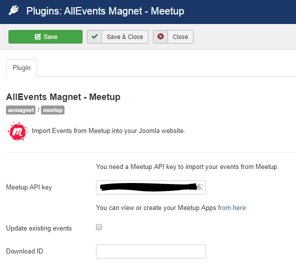

 
The "AllEvents Magnet – Meetup" plugin integrates events from Meetup groups into AllEvents Magnet through a specific plugin. The easiest way is to import your Meetup groups to make them accessible in your favorite events management component. To be able to import the calendars you need to first get the API key as described in the steps below. You will need to have a meetup account in order to import your meetup group events.

## Table of Contents
2. [Install the plugin](#install-the-plugin)
4. [Configure the plugin](#configure-the-plugin)
5. [Meetup Import](#meetup-import)
	
## Install the plugin
1. Download the extension to your local machine as a zip file package.
2. From the backend of your Joomla site (administration) select **Extensions >> Manager**, then Click the <b>Browse</b> button and select the extension package on your local machine. Then click the **Upload & Install** button to install module.
3. Go to **Extensions >> Plugin**, find and click on **AllEvents Magnet – Meetup **. Then enable it.

! If you have problems installing or updating the extension, please try the manual installation process as described here: docs.joomla.org/Installing_an_extension

For update the plugin you can follow [this topic](https://documentation.allevents3.com/allevents/installation/update).

For uninstall the plugin you can follow [this topic](https://documentation.allevents3.com/allevents/installation/uninstall).

## Configure the plugin
### Getting your API key
You need to create a account on meetup.

Log in on [https://secure.meetup.com/meetup_api/key/](https://secure.meetup.com/meetup_api/key/) with your Meetup credentials.

After registering you should see a success message. You will have to generate an API key.

Now you will see your Meetup API key which will be hidden,
In this page, you can also Reset your API key. If you do a reset, don’t forget to update your AllEvents Magnet plugin 
### Setting up your API key
Go to the plugin manager in the Joomla administration back end, edit the  **AllEvents Magnet – Meetup ** plugin and update the Meetup API key.

             

| Option | Description | Type | Value |
| ------ | ----------- | ---- | ----- |
|  Meetup API key |  You can view or create your Meetup Apps [https://secure.meetup.com/meetup_api/key/](https://secure.meetup.com/meetup_api/key/) | text | |
|  Update existing events | Check to updates existing events. (Not Recommend) | checkbox | |
|  Download ID | Enter your Download ID to enable Updates | text | |

## Meetup Import
Import Facebook Events allows you to import meetup events into your Joomla site automatically. 

### Import by Meetup Group URL
> screen

* **Meetup Group URL**:you need meetup group url. So you have to go meetup.com and copy your group name from the URL. Example:
`http://www.meetup.com/your-group/`
* **Import into**: you can choose your events component from dropdown list.
* **Import type**: you import event based on one-time or scheduled import.

then you click on Import events button events import in your Joomla.

### Scheduled Imports
Some possibilities are proposed. You can find them on the specific page [Scheduled Imports](https://documentation.allevents3.com/allevents-magnet-administration/scheduled-imports)

### Manage Scheduled Imports
Some possibilities are proposed. You can find them on the specific page [Manage Scheduled Imports](https://documentation.allevents3.com/allevents-magnet-administration/manage-scheduled-import)